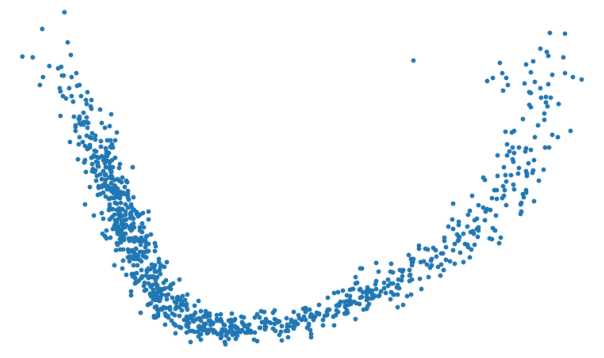
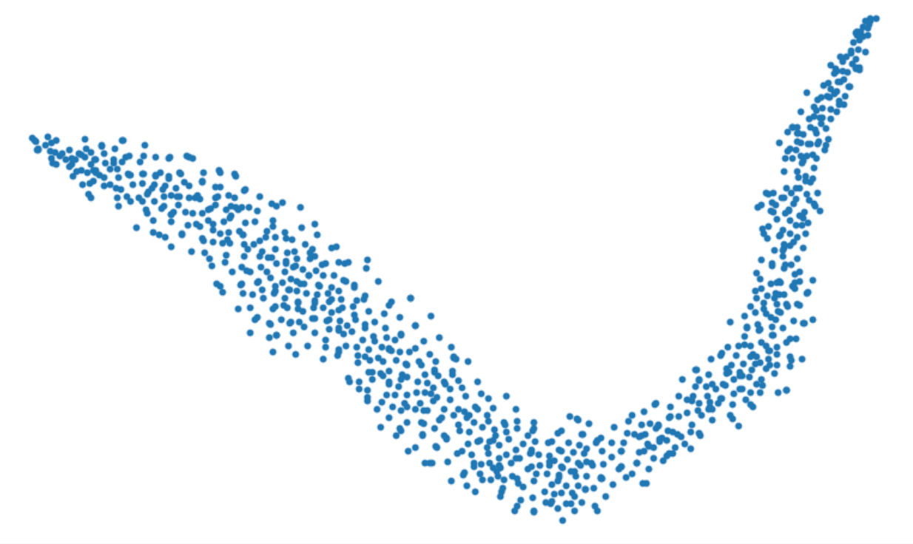
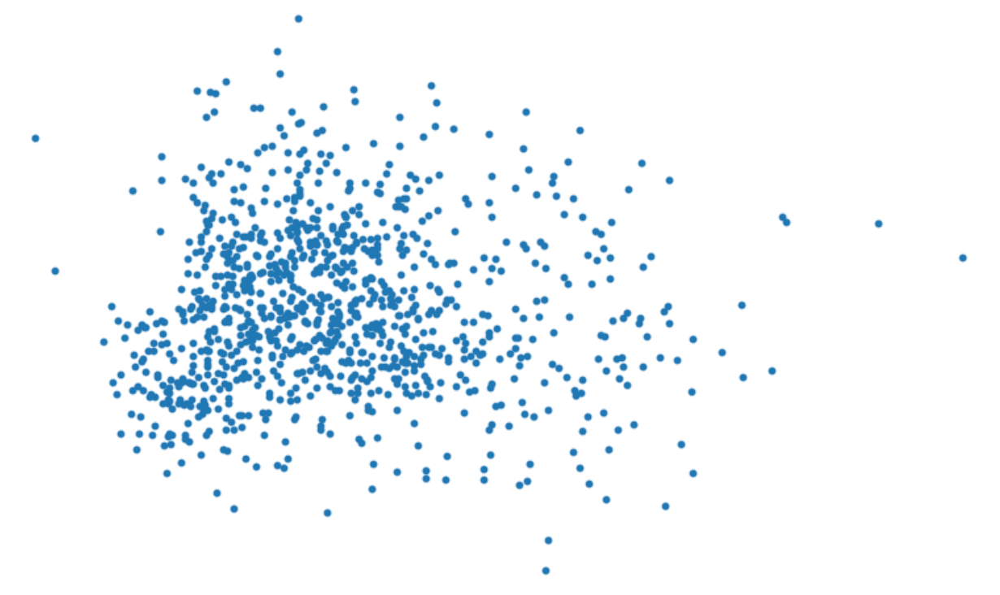
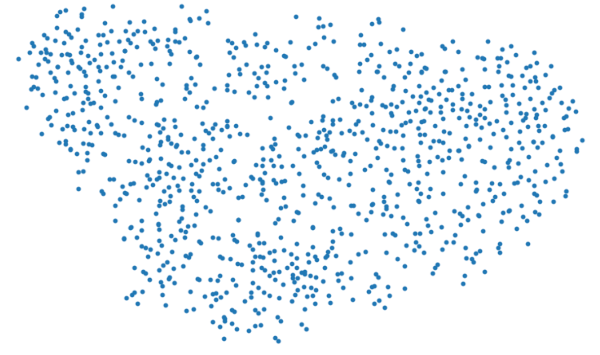
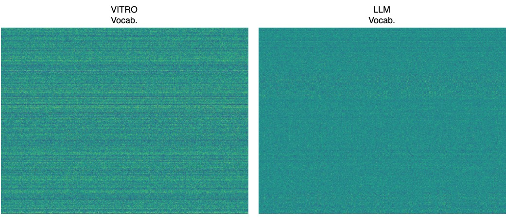

# VITRO: Vocabulary Inversion for Time-series Representation Optimization

Filippos Bellos University of Michigan Ann Arbor, MI, USA Email: fbellos@umich.edu

Nam H. Nguyen Capital One McLean, VA, USA Email: nam.nguyen@capitalone.com

Jason J. Corso University of Michigan Ann Arbor, MI, USA Email: jjcorso@umich.edu

## Abstract
Although  LLMs have demonstrated remarkable capabilities in processing and generating textual data, their
pretrained vocabularies are ill-suited for capturing the nuanced temporal dynamics and patterns inherent in time series.
The discrete, symbolic nature of natural language tokens, which these vocabularies are designed to represent, does not
align well with the continuous, numerical nature of time series data. To address this fundamental limitation, we propose
VITRO. Our method adapts textual inversion optimization from the vision-language domain in order to learn a new time
series per-dataset vocabulary that bridges the gap between the discrete, semantic nature of natural language and the
continuous, numerical nature of time series data. We show that learnable time series-specific pseudoword embeddings
represent time series data better than existing general language model vocabularies, with VITRO-enhanced methods
achieving state-of-the-art performance in long-term forecasting across most datasets. Index Terms—Multivariate Time
Series, Large Language Models, Forecasting, Optimization, Textual Inversion.

Fig. 1: VITRO optimizes learnable pseudo-word embeddings vi for each time series instance Xi and a shared dataset
embedding s to construct a new data-centric time series vocabulary tailored for forecasting. Time series are normalized,
patched, and embedded. These patch embeddings Ei serve as prompts to guide the optimization of pseudo-words. The
composite representation, including statistical features estats, is fed into a frozen LLM, whose output is projected to
generate forecasts ˆYi.

## I. INTRODUCTION

Large Language Models (LLMs) have transformed natural language processing (NLP), excelling in traditional NLP tasks like
text generation but also showing promise in tasks that require complex and structured reasoning [1, 2]. Their impact has
extended beyond NLP, contributing to rapid advancements in computer vision and other signal processing applications
through the development of multimodal models that can process and integrate information from various modalities such as
text, images, and audio. This versatility has naturally led the community to explore their potential in time series
forecasting, a fundamental capability in numerous real-world dynamic systems [3] including energy load management [4],
climate modelling [5], traffic forecasting [6], etc. Traditionally, these forecasting tasks have required extensive
domain expertise and task-specific model designs, an approach that stands in contrast to LLMs, which demonstrate strong
performance across diverse tasks with minimal examples, often in few-shot or zero-shot scenarios [7, 8]. This contrast
underscores the need to consider if and how the pre-trained knowledge and generalization capabilities of LLMs can be
fully harnessed to perform accurate time series forecasting without fine-tuning the underlying model. Time-LLM [9] and
TEST [10] attempt to address this challenge by reprogramming the input time series into text prototype representations
and using textual prompts to provide additional context. Crucially, these methods enable the LLM to perform time series forecasting while keeping the pre-
trained model completely frozen, thus fully leveraging the model’s pre-trained capabilities. Other methods, such as OFA
[11] and S2IP-LLM [12], also investigate the use of pre-trained LLMs for time-series forecasting. However, they require
partial finetuning of the underlying language model to achieve good performance, potentially limiting their ability to
fully exploit the LLM’s pre-trained knowledge. Despite the promise in these methods, they are still limited by the
existing LLM vocabulary they rely on, which fails to capture the nuanced patterns and characteristics specific to time
series data. This limitation naturally raises the question: Is there a better way to represent time series data than
using the general-purpose vocabulary of LLMs, in order to leverage the inherent capabilities of LLMs for effective time
series forecasting? To address this question, we propose VITRO, a new method that, as depicted in Fig.1, constructs a
time series specific vocabulary by learning unique pseudo-words for each time series instance in a dataset, inspired by
the concept of textual inversion [13]. In addition, VITRO optimizes a shared embedding, able to capture the domain
specific dataset information, which in many real-world applications may not always be available or informative. Intuitively, this method bridges the
gap between LLMs and time series data by creating a vocabulary that encodes time series information in a format
interpretable by the language model, while at the same time capturing the subtle variations in time series. We
demonstrate that VITRO can be leveraged across different forecasting approaches and LLM architectures, showcasing its
potential for broad application in the field of time series forecasting. Quantitative experiments show state-of-theart
performance for the methods that leverage VITRO, while qualitative analysis reveals that our learned vocabulary exhibits
distinct patterns in attention weights and embedding distributions, indicating successful specialization for time series tasks.

our vocabulary is informed by the full dataset. It allows us to first establish a strong foundational representation
before focusing on specific forecasting tasks.

### B. Stage 1: Vocabulary Inversion for Time Series

LLMs begin with a text processing step where each word or sub-word in an input string is converted to a token, which is
an index in some pre-defined dictionary. Each token is then linked to a unique embedding vector that can be retrieved
through an index-based embedding lookup. We choose this embedding space as the target for vocabulary inversion.
Specifically, let a time series dataset D = {X1, X2, . . . , Xn}, where n represents the number of time series instances
in a dataset and each time series instance Xi ∈ R1×T represents a time series segment of length T (lookback window). For
this dataset, we designate a set of placeholder strings, P ∗ = {P ∗ 1 , P ∗ 2 , . . . , P ∗ n}, where each P ∗ i
represents a unique time series instance Xi. Additionally, we introduce a placeholder S∗ shared per dataset which
represents the entire dataset-domain information. Concretely, our approach involves an iterative optimization process
for:

## II. METHOD

### A. Problem Formulation and Overview

We formulate our problem of Vocabulary Inversion for Time Series Representation Optimization as follows. Let X ∈ RN×T
denote the time series data consisting of N different 1-dimensional variables across a lookback window of T time steps,
where the i-th series is denoted as Xi ∈ R1×T . We aim to learn a new time series data-centric vocabulary that will
allow a large language model f(·) to better understand the input time series in order to more accurately predict the
next τ time steps based on the input window T. Let Y ∈ RN×τ denote the ground truth values for the next τ time steps,
and ˆY ∈ RN×τ represent the corresponding predictions. The overall objective is to minimize the mean square errors
between Y and ˆY , defined as:

• A corresponding embedding vi for each P ∗ i , effectively expanding the LLM’s vocabulary with n new “words” that
encode time series information.

• A corresponding embedding s for S∗, that encodes the domain information for D as a whole. We start by randomly
initializing each pseudo-word embedding vi and associating the placeholder P ∗ i to it. Similarly, we initialize the
shared embedding s and associate it with S∗. The optimization process then runs for a fixed number of iterations,
optimizing these embeddings to better represent the time series forecasting data. To condition the generation process,
we utilize a small set of text prompt templates containing these placeholders, such as “The time series is P ∗ i ” or
“Forecast the next steps of P ∗ i ”. As shown in Fig. 1, we essentially intervene in the LLM’s embedding process. This
allows us to “inject” a rich set of time series concepts into the LLM’s vocabulary, each reflecting a specific instance
in our dataset. The same happens with the shared embedding, which ”injects” general domain information. 
1) Model Pipeline: Following convention, for each input time series Xi ∈ RT , we first apply reversible instance normalization
(RevIN) [14] to mitigate distribution shift: ˜Xi = RevIN(Xi). We then divide ˜Xi into P overlapping or nonoverlapping
patches of length Lp: XP,i ∈ RP ×Lp [15], where P = j T −Lp

To solve this problem, we are inspired by the approach of textual inversion [13] from the text-to-image diffusion model
literature—a simple yet powerful technique in low-shot image generation that learns a common concept in given images as
a single token in text embedding space. Motivated by its success, we aim to learn different concepts-representations of
time series data as text embeddings and use them to develop a new time series forecasting vocabulary, which we
hypothesize will represent time series data better than the existing general natural language model vocabulary. Our
method consists of two stages. The first stage optimizes a specialized vocabulary tailored for time series forecasting.
This stage captures patterns across an entire dataset, creating a rich vocabulary that reflects the temporal dynamics
and variations inherent in the time series. The primary goal here is to establish a comprehensive representation rather
than immediate forecasting accuracy. In the second stage, we use this specialized vocabulary for the actual forecasting
tasks. This stage benefits from the broad context learned in the first stage, applying it to individual time series
instances to enhance forecasting performance. The two-stage approach ensures that

S k + 2, and S is the horizontal sliding stride. To obtain the final embeddings, we apply a linear transformation to
each patch: Ei = WeXP,i + be, where Ei ∈ RP ×d, We ∈ Rd×Lp is a learnable weight matrix, be ∈ Rd is a learnable bias
vector, and d is the embedding dimension of the target LLM. Patch Embeddings as Prompts. We leverage the patch
embeddings Ei, as a composite prompt to guide the LLM’s bv ∈ Rn′ are learnable parameters. For each patch embedding Ei and each core lexicon embedding cm ∈ C, we compute the
cosine similarity: sim(Ei, cm) = (Ei · cm)/(∥Ei∥∥cm∥). From these n′ core lexicon embeddings, we then select the top k
embeddings with the highest similarity scores, where k < n′. This similarity-based ranking and selection ensures that we
identify the most relevant core lexicon embeddings for each patch, while maintaining computational efficiency by
operating in a reduced similarity space (n′ instead of n). We then form an augmented embedding for each patch: ˆei =
[Ei; c1; c2; ...; ck; s; estats], that will serve as input to the frozen pre-trained LLM, which in this case is GPT2.
Attention-based approach As mentioned, we also employ TimeLLM’s [9] attention-based approach , demonstrating the
improved results (in Section III) when using our optimized vocabulary over the existing one. This method involves a
multi-head cross-attention mechanism between patch embeddings and our optimized vocabulary, allowing the model to
dynamically select relevant information. Concretely, we employ a multi-head cross-attention layer. For each head h = {1,
..., H}, we define the Query matrices as Q(i) h = EiW Q h , the Key matrices as K(i) h = CW K h and the Value matrices
as V (i) h = CW V h , where W Q h , W K h , W V h ∈ Rd×dh, and dh = d/H. The attention operation for each head is:processing of time series data and the optimization of pseudowords vi, and shared embedding s. This approach is inspired
by recent advancements showing that non-textual data modalities can be effectively integrated as prefixes in prompts to
facilitate reasoning [16]. In our case, the patch embeddings Ei serve as a numerical representation of the time series,
while the pseudo-words vi and shared embedding s provide learnable, text-like anchors for the model. For each pseudo-
word P ∗ i , we learn a corresponding embedding vector vi ∈ Rd. We pass P ∗ i through the LLM’s tokenizer to obtain a
token representation which we associate in the LLM’s embedding lookup table with our learnable embedding vi.
Accordingly, we associate the shared word S∗ with the learned shared embedding s in the embedding lookup process. We
then concatenate Ei, vi and s along with certain statistics we calculate for Xi, and we feed them through the frozen LLM
to obtain the last hidden layer output hi ∈ Rh: hi = f([Ei; ui; s; estats]), where f(·) denotes the frozen LLM and ;
denotes concatenation. The last hidden layer output hi is passed through a learnable linear layer g(·) to generate the
forecasted values ˆYi: ˆYi = g(hi) = W × hi + b, where W ∈ Rτ×h and b ∈ Rτ are the learnable weights and bias. 

2) Optimization Objective: Our optimization objective is to minimize the loss L between the forecasted values ˆYi and the
ground truth future values Yi for each time series instance Xi:

RP ×dh across all heads yields Z(i) ∈ RP ×d, which is then passed through the frozen LLM, which in this case is Llama7B,
along with the optimized shared embedding that encapsulates the domain information, and the calculated statistics.

We optimize the shared embedding s, pseudo-word embeddings V = v1, v2, ..., vn and all other learnable parameters θ
(including We, be, W and b) to minimize the total loss:

## III. EXPERIMENTS

In our experimental evaluation, we compare the effectiveness of VITRO vocabularies against the general natural language
LLM vocabularies within our Stage 2 framework, demonstrating the advantages of our optimized time series representation.
We benchmark VITRO-enhanced methods against other LLM-based methods and traditional time series forecasting baselines on
the task of long-term forecasting. We also provide a qualitative analysis of VITRO and existing LLM vocabularies. For
all baselines, we adhere to the experimental configurations outlined by [19], utilizing their unified pipeline1.
Baselines. The baselines include the best performing approaches based on LLMs, i.e., Time-LLM [9] whose method is used
as variant of our stage 2, and S2IP-LLM [12] even though this method partly finetunes the backbone model. We also
include the best performing Transformer-based and nonTransformer methods, i.e. PatchTST [15] and DLinear [20].

### C. Stage 2: Time Series Forecasting with Learned Vocabulary

Stage 2 of our method focuses on leveraging the learned vocabulary V for time series forecasting. We present two
approaches using different LLM architectures (i.e. GPT2 [17] and LLaMa [18]) demostrating that the effectiveness of
VITRO is not restricted to one type of LLM or LLMbased method: a similarity-based selection method that directly
utilizes the vocabulary, and TimeLLM’s [9] attention-based approach that allowing us to assess VITRO’s benefits compared
to the standard LLM vocabulary within the TimeLLM method, which is the current state of the art method that utilizes a
frozen pretrained LLM. Similarity-based Selection (Sim) For computational efficiency, instead of using the word
embeddings from the full vocabulary V , we first derive a reduced set of core lexicon embeddings C using a linear
mapping function h(·): C = h(V ) = WvV + bv, where C ∈ Rn′×d, n′ is the number of core lexicon embeddings with n′ ≪ n,
Wv ∈ Rn′×n and

### A. Long-term Forecasting

Setup. We evaluate the effectiveness of VITRO across 7 public datasets: Weather, Electricity, Traffic, and four ETT

https://github.com/thuml/Time-Series-Library

|Methods|VITRO&amp;#45;Sim|Sim|VITRO&amp;#45;TimeLLM|TimeLLM|S2IP&amp;#45;LLM|PatchTST|Dlinear|
|---|---|---|---|---|---|---|---|
|Metric|MSE&lt;br&gt;MAE|MSE&lt;br&gt;MAE|MSE&lt;br&gt;MAE|MSE&lt;br&gt;MAE|MSE&lt;br&gt;MAE|MSE&lt;br&gt;MAE|MSE&lt;br&gt;MAE|
|**ETTh1**|**0.412****_↓_**&lt;br&gt;**0.430****_↓_**|0.442&lt;br&gt;0.449|0.416**_↓_**&lt;br&gt;0.437**_↓_**|0.437&lt;br&gt;0.450|0.425&lt;br&gt;0.440|0.444&lt;br&gt;0.453|0.418&lt;br&gt;0.439|
|**ETTh2**|0.351**_↓_**&lt;br&gt;**0.393****_↓_**|0.370&lt;br&gt;0.402|**0.349****_↓_**&lt;br&gt;0.395**_↓_**|0.360&lt;br&gt;0.400|0.358&lt;br&gt;0.403|0.381&lt;br&gt;0.411|0.502&lt;br&gt;0.481|
|**ETTm1**|0.353**_↓_**&lt;br&gt;**0.380****_↓_**|0.365&lt;br&gt;0.388|0.352**_↓_**&lt;br&gt;0.387**_↓_**|0.367&lt;br&gt;0.396|**0.347**&lt;br&gt;0.382|0.363&lt;br&gt;0.391|0.357&lt;br&gt;0.389|
|**ETTm2**|**0.260****_↓_**&lt;br&gt;0.323**_↓_**|0.284&lt;br&gt;0.332|0.263**_↓_**&lt;br&gt;**0.321****_↓_**|0.264&lt;br&gt;0.325|0.261&lt;br&gt;0.326|0.267&lt;br&gt;0.325|0.275&lt;br&gt;0.340|
|**Weather**|0.230**_↓_**&lt;br&gt;0.268**_↓_**|0.233&lt;br&gt;0.273|**0.225****_↓_**&lt;br&gt;**0.263****_↓_**|0.227&lt;br&gt;0.265|0.229&lt;br&gt;0.267|**0.225**&lt;br&gt;0.264|0.248&lt;br&gt;0.300|
|**Electricity**|**0.161****_↓_**&lt;br&gt;0.258**_↓_**|0.165&lt;br&gt;0.261|0.166**_↓_**&lt;br&gt;0.267**_↓_**|0.168&lt;br&gt;0.270|0.167&lt;br&gt;0.263|**0.161**&lt;br&gt;**0.252**|0.166&lt;br&gt;0.263|
|**Traffic**|0.399**_↓_**&lt;br&gt;0.276**_↓_**|0.402&lt;br&gt;0.279|0.408**_↓_**&lt;br&gt;0.306**_↓_**|0.410&lt;br&gt;0.310|0.418&lt;br&gt;0.303|**0.390**&lt;br&gt;**0.263**|0.433&lt;br&gt;0.295|

TABLE I: Long-term forecasting results for {96, 192, 336, 720} horizons. A lower value indicates a better performance.
All results are averaged from four forecasting horizons{96, 192, 336, 720}. Arrows↓ indicate positive impact of VITRO
compared to existing LLM vocabulary. Bold: best results. Underlined: second best. We reproduced TimeLLM, S2IP-LLM,
PatchTST, Dlinear results using their official open-source implementations.

datasets (i.e., ETTh1, ETTh2, ETTm1, and ETTm2), which have been widely adopted as benchmarking datasets for longterm
forecasting models. The input time series length is 512 and we evaluate the performance on four different horizons {96,
192, 336, 720}. The evaluation metrics include the mean square error (MSE) and the mean absolute error (MAE). Results.
Our results are shown in TABLE I. When we replace the existing general-purpose vocabulary with VITRO’s learned
vocabulary in both the Time-LLM approach and our similarity-based method, we observe consistent improvements across all
7 datasets tested for both MSE and MAE metrics. The impact is particularly pronounced for the ETTh1, ETTh2 and ETTm1
datasets. When compared to state-of-theart methods, our VITRO-enhanced approaches consistently outperform across most
datasets. Specifically, for the MAE metric our methods outperform the LLM-based method (S2IPLLM) in all 7 datasets while
for MSE in 6 out of 7 datasets. Comparing against the transformer based method (PatchTST) VITRO performs better in 5 out
of 7 datasets for the MAE metric, 4 out of 7 for MSE while achieving the same result for the same metric in 2 datasets
(i.e. Electricity, Weather). Finally, we outperform the non-transformer method (Dlinear) in all datasets for both
metrics.

PCA t-SNE

Vocab. LLM

VITRO

Vocab.

Fig. 2: PCA and t-SNE visualizations of VITRO and existing general-purpose vocabulary embedding space.

Fig. 3: VITRO and LLM existing vocabularies heatmaps. Each row corresponds to a word in the vocabulary, the y-axis
represents the index of the word, and the x-axis denotes the embedding dimensions. Brighter colors indicate higher
values.

## IV. QUALITATIVE ANALYSIS

Figures 2 and 3 reveal the impact of the specialized nature of the new vocabulary for time series tasks, contrasting
with the general-purpose characteristics of existing vocabularies. In Fig. 3, the heatmaps, generated by the attention-
based approach of stage 2 (TimeLLM approach), for the VITRO vocabulary show distinct horizontal striping patterns. This
suggests that certain vocabulary elements are consistently more important across different parts of the input sequence,
indicating that our vocabulary has captured some general features and underlying structures in time series data
applicable across various time steps. In contrast, the existing vocabulary’s weights show a more uniform distribution,
suited for more general language tasks. Figure 2’s PCA and TSNE visualizations further support this distinction: the new
vocabulary forms a U-shaped manifold, suggesting a robust and structured embedding space, which indicates a specialized
representation of time series concepts, while the existing vocabulary reveals

a diffuse, circular distribution typical of general-purpose language embeddings.

## V. CONCLUSION AND FUTURE WORK

VITRO demonstrates significant potential in enhancing LLMs for time series forecasting by learning a time series data-
centric vocabulary through vocabulary inversion. Our results consistently show that time series forecasting accuracy can
be improved by replacing the LLM’s general-purpose vocabulary with our VITRO-optimized one. However, as an iterative
optimization-based method, VITRO’s computational cost may limit its application in larger datasets. Future research
directions will explore further optimization of the vocabulary learning process, extending VITRO to other time series
tasks beyond forecasting, and integrating VITRO with other LLMbased methods (e.g. S2IP-LLM).

## REFERENCES

Liang, Yuan-Fang Li, Shirui Pan, and Qingsong Wen, “Time-LLM: Time series forecasting by reprogramming large language
models,” in The Twelfth International Conference on Learning Representations, 2024. [10] Chenxi Sun, Hongyan Li, Yaliang
Li, and Shenda Hong, “TEST: Text prototype aligned embedding to activate LLM’s ability for time series,” in The Twelfth
International Conference on Learning Representations, 2024. [11] Tian Zhou, Peisong Niu, Xue Wang, Liang Sun, and Rong
Jin, “One fits all: Power general time series analysis by pretrained LM,” in Thirty-seventh Conference on Neural
Information Processing Systems, 2023. [12] Zijie Pan, Yushan Jiang, Sahil Garg, Anderson Schneider, Yuriy Nevmyvaka, and
Dongjin Song, “$sˆ2$IP-LLM: Semantic space informed prompt learning with LLM for time series forecasting,” in Forty-
first International Conference on Machine Learning, 2024. [13] Rinon Gal, Yuval Alaluf, Yuval Atzmon, Or Patashnik, Amit
Haim Bermano, Gal Chechik, and Daniel Cohenor, “An image is worth one word: Personalizing textto-image generation using
textual inversion,” in The Eleventh International Conference on Learning Representations, 2023. [14] Taesung Kim, Jinhee
Kim, Yunwon Tae, Cheonbok Park, Jang-Ho Choi, and Jaegul Choo, “Reversible instance normalization for accurate time-
series forecasting against distribution shift,” in International Conference on Learning Representations, 2022. [15] Yuqi
Nie, Nam H Nguyen, Phanwadee Sinthong, and Jayant Kalagnanam, “A time series is worth 64 words: Long-term forecasting
with transformers,” in International Conference on Learning Representations, 2023. [16] Maria Tsimpoukelli, Jacob
Menick, Serkan Cabi, S. M. Ali Eslami, Oriol Vinyals, and Felix Hill, “Multimodal few-shot learning with frozen language
models,” in Advances in Neural Information Processing Systems, A. Beygelzimer, Y. Dauphin, P. Liang, and J. Wortman
Vaughan, Eds., 2021. [17] Alec Radford, Jeffrey Wu, Rewon Child, David Luan, Dario Amodei, Ilya Sutskever, et al.,
“Language models are unsupervised multitask learners,” OpenAI blog, vol. 1, no. 8, pp. 9, 2019. [18] Hugo Touvron,
Thibaut Lavril, Gautier Izacard, Xavier Martinet, Marie-Anne Lachaux, Timoth´ee Lacroix, Baptiste Rozi`ere, Naman Goyal,
Eric Hambro, Faisal Azhar, et al., “Llama: Open and efficient foundation language models,” arXiv preprint
arXiv:2302.13971, 2023. [19] Haixu Wu, Tengge Hu, Yong Liu, Hang Zhou, Jianmin Wang, and Mingsheng Long, “Timesnet:
Temporal 2dvariation modeling for general time series analysis,” in International Conference on Learning
Representations, 2023. [20] Ailing Zeng, Muxi Chen, Lei Zhang, and Qiang Xu, “Are transformers effective for time series
forecasting?,” in Proceedings of the AAAI Conference on Artificial Intelligence, 2023.

[1] Jason Wei, Xuezhi Wang, Dale Schuurmans, Maarten Bosma, Brian Ichter, Fei Xia, Ed H. Chi, Quoc V. Le, and Denny
Zhou, “Chain-of-thought prompting elicits reasoning in large language models,” in Proceedings of the 36th International
Conference on Neural Information Processing Systems, Red Hook, NY, USA, 2024, NIPS ’22, Curran Associates Inc. [2]
Filippos Bellos, Yayuan Li, Wuao Liu, and Jason Corso, “Can large language models reason about goal-oriented tasks?,” in
Proceedings of the First edition of the Workshop on the Scaling Behavior of Large Language Models (SCALE-LLM 2024), St.
Julian’s, Malta, Mar. 2024, pp. 24–34, Association for Computational Linguistics. [3] Ming Jin, Huan Yee Koh, Qingsong
Wen, Daniele Zambon, Cesare Alippi, Geoffrey I. Webb, Irwin King, and Shirui Pan, “A survey on graph neural networks for
time series: Forecasting, classification, imputation, and anomaly detection,” IEEE transactions on pattern analysis and
machine intelligence, vol. PP, 2023. [4] Hengbo Liu, Ziqing Ma, Linxiao Yang, Tian Zhou, Rui Xia, Yi Wang, Qingsong Wen,
and Liang Sun, “Sadi: A self-adaptive decomposed interpretable framework for electric load forecasting under extreme
events,” in IEEE International Conference on Acoustics, Speech and Signal Processing, 2023. [5] Stephen H Schneider and
Robert E Dickinson, “Climate modeling,” Reviews of Geophysics, vol. 12, no. 3, pp. 447–493, 1974. [6] Yihong Tang, Ao
Qu, Andy H. F. Chow, William H. K. Lam, Sze Chun Wong, and Wei Ma, “Domain adversarial spatial-temporal network: A
transferable framework for short-term traffic forecasting across cities,” CoRR, vol. abs/2202.03630, 2022. [7] Tom B.
Brown, Benjamin Mann, Nick Ryder, Melanie Subbiah, Jared Kaplan, Prafulla Dhariwal, Arvind Neelakantan, Pranav Shyam,
Girish Sastry, Amanda Askell, Sandhini Agarwal, Ariel Herbert-Voss, Gretchen Krueger, Tom Henighan, Rewon Child, Aditya
Ramesh, Daniel M. Ziegler, Jeffrey Wu, Clemens Winter, Christopher Hesse, Mark Chen, Eric Sigler, Mateusz Litwin, Scott
Gray, Benjamin Chess, Jack Clark, Christopher Berner, Sam McCandlish, Alec Radford, Ilya Sutskever, and Dario Amodei,
“Language models are few-shot learners,” in Advances in Neural Information Processing Systems 33, NeurIPS 2020, December
6-12, 2020, Hugo Larochelle, Marc’Aurelio Ranzato, Raia Hadsell, MariaFlorina Balcan, and Hsuan-Tien Lin, Eds., 2020.
[8] Takeshi Kojima, Shixiang Shane Gu, Machel Reid, Yutaka Matsuo, and Yusuke Iwasawa, “Large language models are zero-
shot reasoners,” Advances in neural information processing systems, vol. 35, pp. 22199– 22213, 2022. [9] Ming Jin, Shiyu
Wang, Lintao Ma, Zhixuan Chu, James Y. Zhang, Xiaoming Shi, Pin-Yu Chen, Yuxuan