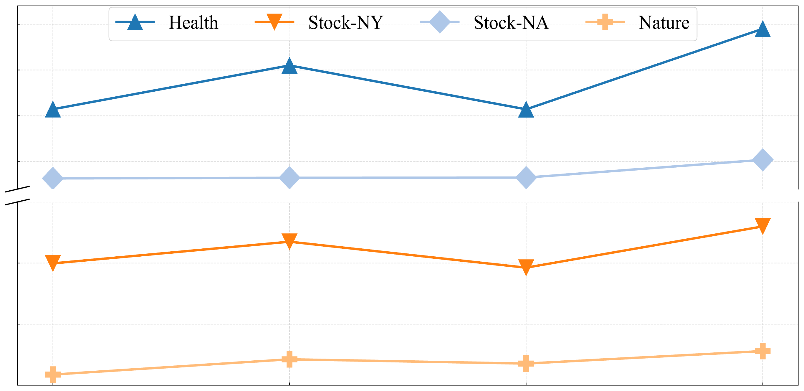
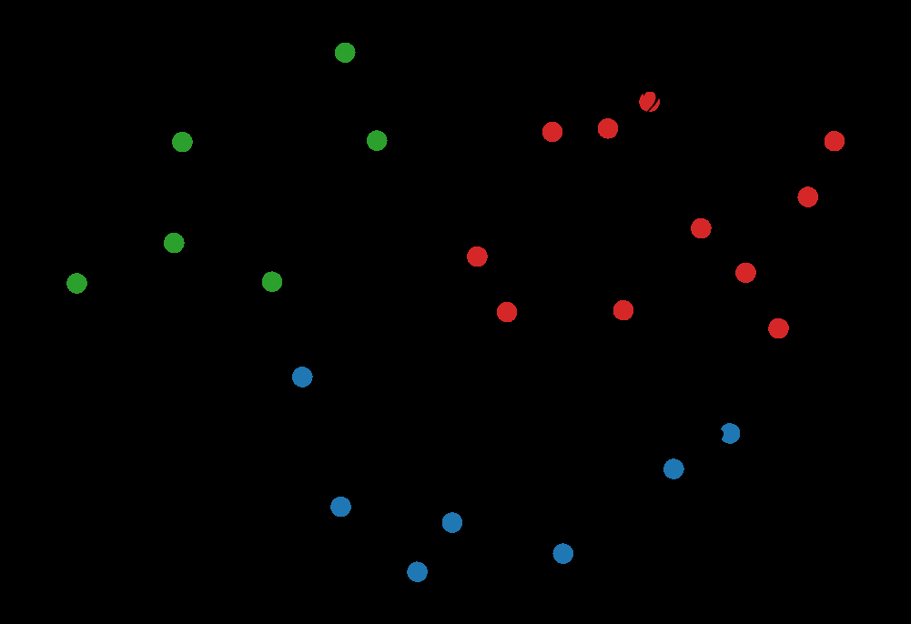
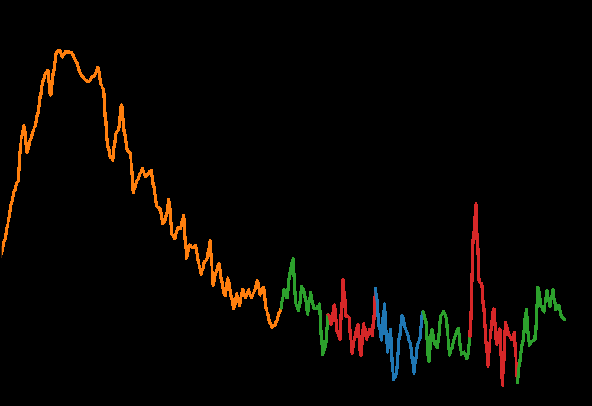

# FROM VALUES TO TOKENS: AN LLM-DRIVEN FRAMEWORK FOR CONTEXT-AWARE TIME SERIES FORECASTING VIA SYMBOLIC DISCRETIZATION

Anonymous authors Paper under double-blind review

## ABSTRACT

Time series forecasting plays a vital role in supporting decision-making across a wide range of critical applications,
including energy, healthcare, and finance. Despite recent advances, forecasting accuracy remains limited due to the
challenge of integrating historical numerical sequences with contextual features, which often comprise unstructured
textual data. To address this challenge, we propose TokenCast, a large language model (LLM) driven framework that
leverages languagebased symbolic representations as a unified intermediary for context-aware time series forecasting.
Specifically, TokenCast employs a discrete tokenizer to transform continuous numerical sequences into temporal tokens,
enabling structural alignment with language-based inputs. To effectively bridge the semantic gap between modalities,
both temporal and contextual tokens are embedded into a shared representation space via a pre-trained LLM, further
optimized with autoregressive generative objectives. Building upon this unified semantic space, the aligned LLM is
subsequently fine-tuned in a supervised manner to predict future temporal tokens, which are then decoded back into the
original numerical space. Extensive experiments are conducted on multiple real-world datasets, whose results reveal the
performance of our framework and highlight its potential as a generative framework for multimodal time series
forecasting. The code is available for further research at: https://anonymous.4open.science/r/TokenCast-8EFF.

## 1 INTRODUCTION

Time series forecasting (TSF) is critical for decision-making in domains such as energy (Das et al., 2023; Jin et al.,
2024; Wang et al., 2025), healthcare (Qiu et al., 2024), and finance (Feng et al., 2019). The goal is to predict future
values based on historical observations and associated contextual features. In practice, accurate forecasting requires
not only modeling temporal dependencies in numerical sequences, but also understanding how they interact with external
contextual factors—such as static attributes or dynamic events (Liu et al., 2024b). Fundamentally, TSF can be viewed as
learning a mapping from past values and contextual features to future outcomes (Jiang et al., 2025).

To learn this mapping, researchers have proposed a comprehensive range of methods, ranging from classical statistical
models to modern data-driven approaches. Traditional methods, such as ARIMA (Hyndman & Khandakar, 2008) and state-space
models (Winters, 1960), rely on strong assumptions about data generation and often incorporate domain-specific priors.
In contrast, recent data-driven approaches such as deep learning models aim to learn patterns directly from data without
handcrafted assumptions. Architectures based on RNNs (Lai et al., 2018), CNNs (Cheng et al., 2025b), Transformers (Zhou
et al., 2022), and MLPs (Challu et al., 2023) have been widely adopted, each capturing different aspects of temporal
dependencies. However, most of these models assume homogeneous numerical inputs and struggle to effectively incorporate
complex contextual features, particularly those with heterogeneous modalities.

Beyond capturing temporal dependencies, there is an increasingly growing emphasis in recent research on incorporating
contextual features to enhance forecasting performance (Liu et al., 2024a; Williams et al., 2024; Liu et al., 2024b).
These features typically fall into two categories: dynamic exogenous variables (e.g., weather conditions, event
indicators) and static attributes (e.g., product types, patient demographics, market segments). When contextual features share the same numerical modality as the target
series, they can be directly modeled as additional input channels. However, many particularly high-value contextual
features, such as clinical notes, policy texts, or user logs, are expressed in unstructured textual form. This
heterogeneity poses significant challenges for aligning and integrating information across modalities.

(a) Linear Adapter (c) Symbolic Intermediary

Time Series

Projector

Representation Modeling

(b) Soft Prompt

Text De-Tokenizer

Text DeTokenizer

Time Series De-Tokenizer

Text Tokenizer

Text Embedder

Time Series

Embedder

Figure 1: Methods for representation modeling of time series and contextual features: (a) linear adapter, (b) soft
prompt, and (c) symbolic intermediary.

Motivated by this question, we explore a more expressive yet under-explored paradigm that formulates time series
forecasting as a multimodal discrete context understanding and generation problem, powered by pre-trained LLMs, as
illustrated in Figure 1 (c). The key idea is to transform continuous numerical sequences into discrete tokens and embed
them into the same semantic space as contextual language inputs. This formulation enables the full use of LLMs’
capabilities in semantic understanding, contextual reasoning, and autoregressive generation. However, this paradigm
introduces several non-trivial challenges. First, discretizing dynamic time series is more difficult than compressing
static data, as it requires preserving temporal dependencies while reducing granularity. Second, even with symbolic
representations, semantic misalignment between temporal tokens and contextual features may hinder effective fusion.
Finally, it remains unclear whether time series forecasting can be effectively addressed through autoregressive
generation over discrete tokens—a direction still largely unexplored.

Based on the above analysis, we propose TokenCast, an LLM-driven framework for context-aware time series forecasting via
symbolic discretization. TokenCast begins with a time series tokenizer that converts continuous sequences into temporal
tokens, mitigating structural discrepancies across data modalities. To bridge the semantic gap, temporal and contextual
tokens are jointly embedded into a shared representation space using a pre-trained LLM, optimized via an autoregressive
objective while keeping the backbone frozen and tuning only the embedding layer. Building on this unified semantic
space, the aligned LLM is further fine-tuned with supervised forecasting signals to enhance predictive performance. We
evaluate TokenCast on diverse real-world datasets enriched with contextual features. Experimental results show that
TokenCast achieves strong accuracy and generalization across domains. We also conduct comprehensive ablation and
qualitative studies, offering insights into the flexibility of symbolic, LLM-based time series forecasting.

## 2 RELATED WORK

Time series forecasting (TSF) is a fundamental task across various domains. Traditional approaches typically rely on
statistical assumptions such as stationarity and linearity, and often depend on handcrafted assumptions that limit their
flexibility (Holt, 2004; Kalekar et al., 2004). Alternatively, datadriven methods (Chen & Guestrin, 2016), particularly
those based on deep learning, have advanced TSF by learning temporal patterns directly from data. RNN-based models (Wang
et al., 2019) capture dependencies through recurrence, CNN-based models (Wang et al., 2023) enhance local pat-

tern extraction, and Transformer-based architectures (Shi et al., 2024) are well-suited for modeling long-range
interactions. Furthermore, MLP-based approaches (Wang et al., 2024b) demonstrate that simple architectures can achieve
competitive performance with improved computational efficiency. These models mainly focus on numerical data, with less
emphasis on unstructured context.

In addition to modeling temporal dependencies, recent research increasingly emphasizes the integration of contextual
features for accurate forecasting (Chang et al., 2023; Liu et al., 2024d; Hu et al., 2025). Two major lines of research
have emerged in this direction. One line of research focuses on deep learning architectures that explicitly model
feature interactions (Gasthaus et al., 2019). For example, TimeXer (Wang et al., 2024c) employs cross-attention
mechanisms to fuse dynamic and static modalities. Another line of research leverages pre-trained LLMs for multimodal
modeling (Cheng et al., 2025a; Liu et al., 2025). Some approaches, such as TEMPO (Cao et al., 2023), utilize linear
adapters to project time series features into the LLM’s semantic space. Others, like Promptcast (Xue & Salim, 2023),
employ soft prompts to guide the frozen LLM’s behavior. However, these promising approaches fail to bridge the
structural gap between numerical and textual modalities.

## 3 THE PROPOSED TOKENCAST

In this section, we present the precise formal problem definition, clarify the key concepts and notations used
consistently throughout the paper, and provide an overview of the TokenCast.

### 3.1 PROBLEM FORMULATION

We consider a dataset D = {(Xi, Ti, Pi)}N i=1 of N multimodal time series instances. For each instance, X ∈ RL×C
represents the multivariate time series over L time steps and C channels, T denotes the contextual features, and P ∈ RLP
×C is the ground-truth future sequence over a horizon LP . The contextual features T are tokenized to tokens Y using the
tokenizer of a pre-trained LLM, while the time series X is converted into discrete tokens Zq via a learnable mapping fθ
: X 7→ Zq. These two token sequences are then concatenated to form a token sequence Z = [Zq; Y ] ∈VT ′. We use boundary
markers to delimit the temporal tokens of ˆZ. Finally, a decoding function gϕ : ˆZ 7→ ˆP is applied to reconstruct the
raw time series ˆP ∈ RLP ×C.

### 3.2 FRAMEWORK OVERVIEW

Figure 2 illustrates the overview of the TokenCast, which consists of three main stages. The process begins with the
time series tokenizer, which transforms continuous time series into a sequence of discrete tokens via a decoupled and
dynamical vector quantization tokenizer. Subsequently, both the temporal and contextual tokens are then jointly
processed by a pre-trained LLM, which performs cross-modality alignment under autoregressive objectives. Following this
alignment, the aligned LLM is adapted to the forecasting task via generative fine-tuning, enabling token prediction. The
predicted tokens are decoded to raw time series using a frozen time series de-tokenizer. The following sections
elaborate on the principal stages of the TokenCast.

### 3.3 TIME SERIES DISCRETIZATION

#### 3.3.1 TIME SERIES TOKENIZER

To fully harness the generative and reasoning capabilities of language models, symbolic representation naturally arises
as an effective intermediary. Accordingly, we employ time series discretization as a simple yet powerful approach to
establish this bridge. It is worth noting that existing approaches, such as Symbolic Aggregate Approximation (SAX) (Lin
et al., 2007), have achieved progress in time series discretization but often suffer from significant information loss
due to dimensionality reduction. In contrast, reconstruction-based methods (Van Den Oord et al., 2016) map subsequences
to discrete codes from a predefined codebook and achieve more precise representations through reconstruction
optimization. While preserving the original information is advantageous, previous reconstruction-based methods typically
encode the entire sequence, overlooking the statistical properties of time series. In the forecasting task, Reversible
Instance Normalization (RevIN) (Kim et al.,

Historical Time Series Predicted Time Series

Reverse Instance Norm. Reverse Instance Norm.

(a) Time Series Discretization

Dynamical

𝜇𝐻 𝜎(𝐻)

Time Series De-Tokenizer

(b) Cross-modality Alignment Next Token Prediction

Shared Weights

Conversation  Analysis  Output Tokens: <TS_Token2>…

Time Series De-Tokenizer Text De-Tokenizer

(c) Generative Fine-tuning

Predicted Time Series

<System Prompt> ### Domain ### Instruction ### Statistics ### Input Tokens <TS_Token1>…

<System Prompt> ### Domain ### Instruction ### Statistics ### Input Tokens <TS_Token1>…

Historical Time Series Predicted Time Series

Multivariate Time Series

Historical Time Series

Contextual Features

Time Series Contextual Features

Figure 2: Overview of the framework for context-aware time series forecasting: (a) time series tokenizer to address the
structural differences between modalities, (b) cross-modality alignment with an autoregressive objective to bridge the
modalities, and (c) generative fine-tuning and contextaware forecasting through time series decoding for horizon
prediction.

2021) is widely used, yet its normalization and denormalization steps risk leaking future information. To overcome this
limitation, we propose a decoupled and dynamic tokenizer.

As illustrated in Figure 2 (a), similar to the forecasting phase, we divide the multivariate time series into a
historical time series H ∈ RLH×C and a predicted time series P ∈ RLP ×C, which can be formally represented as X = [H; P]
∈ RL×C. The process begins with a reversible instance normalization (RIN) layer. We compute the mean µ(H) and standard
deviation σ(H) solely from the historical time series H, and apply them to normalize the time series X, thereby
preventing future information leakage. These statistics are retained for inverse transformation during decoding. Instead
of employing separate encoders, we adopt a shared encoder, which facilitates the joint modeling of both local and global
information. The normalized time series is then passed through a causal encoder fenc, yielding a sequence of continuous
latent representations Z = fenc(X) ∈ RT ×d, where T is the number of latent vectors and d is the feature dimension. To
discretize the latent representations, we apply a vector quantization layer. For domain i, a learnable codebook Ci =
{ei,k}K k=1 ⊂ Rd is maintained, containing K embedding vectors. Each latent vector zt ∈ Rd is mapped to its nearest
neighbor in the codebook as zq t = ei,k∗, where k∗ = arg mink ∥zt − ei,k∥2 2. The output of this layer is a quantized
sequence Zq = (zq 1, . . . , zq T ), and the corresponding sequence of indices {k∗} serves as the discrete tokens for
downstream modeling. These tokens are subsequently decoded by a shared causal decoder fdec, rather than by separate
decoders, which ensures consistent reconstruction and enables the predicted part to dynamically exploit richer
historical features. Then, the final reconstruction ˆX is obtained by applying the inverse RIN operation using the
stored statistics µ(H) and σ(H), i.e., ˆX = fdenorm(fdec(Zq)).

#### 3.3.2 TRAINING OBJECTIVE

The tokenizer is optimized by minimizing the objective function defined as follows:

L = Lrecon + β (Lcommit + Lcodebook) + γLdiversity, (1)

where Lrecon = ∥ ˆX − X∥2 2 is the reconstruction loss that optimizes both the encoder and decoder. Due to the non-
differentiability of the arg min operation in quantization, we employ the straight-through estimator (STE) during
backpropagation. To train the vector quantizer, we include: Lcodebook = ∥sg[Z] − Zq∥2 2, Lcommit = ∥Z − sg[Zq]∥2 2,
where sg[·] denotes the stop-gradient operator, which prevents gradients from flowing into its argument during
backpropagation. To avoid codebook collapse and promote diverse usage of codebook entries, we further add a diversity
loss Ldiversity = 1 N PN i=1 1 di+ϵ, where di = minj̸=i ∥ei − ej∥2 denotes the nearest-neighbor distance between
codebook embeddings. This penalty discourages vectors from clustering too closely and encourages more uniform
utilization of the codebook.

### 3.4 PRE-TRAINED LLM BACKBONE FORMULATION

Following the discretization of time series into discrete tokens, the next challenge is to model the complex
dependencies embedded in these sequences. While architectures like TCNs or Transformers can be trained from scratch, we
argue that a pre-trained LLM serves as a more effective backbone. This is supported by two observations: (1) a pre-
trained LLM possesses strong semantic understanding and contextual reasoning capabilities acquired from large-scale
corpora, and (2) the structure of discrete time series tokens closely resembles that of language tokens (Zhao et al.,
2023). By casting forecasting as a generative task, we directly leverage the LLM’s autoregressive generation ability. To
guide LLM reasoning and incorporate contextual features, we employ a structured prompt template, as shown in Figure 2
(b). This prompt template consists of four essential components: domain knowledge, task instructions, statistical
properties, and discrete time series tokens. This design ensures token-level consistency with language tokens and
introduces task-specific descriptions alongside statistical attributes, enabling the LLM to perform instruction-driven
generation.

### 3.5 CROSS-MODALITY ALIGNMENT OF TIME SERIES AND CONTEXTUAL FEATURES

While discretization aligns time series structurally with language tokens, a semantic gap remains between time series
and contextual features. Existing methods often introduce projection modules (e.g., MLPs) to map time series into the
LLM’s latent space for fusion (Liu et al., 2025). Although effective in downstream tasks, these strategies rely on
external transformation modules for alignment, which bypass the language model’s native vocabulary modeling mechanism.
To this end, we implement a more explicit vocabulary-level alignment strategy. As illustrated in Figure 2 (b), we
construct a unified vocabulary by directly appending K temporal tokens and S task-specific special tokens to the
original vocabulary Vorig of the pre-trained LLM, forming an extended vocabulary V . Correspondingly, a shared embedding
matrix E ∈ R|V |×d is used to encode all tokens, regardless of their modality origin. This unified embedding mechanism
enables seamless fusion of time series and contextual features while maintaining alignment with the pre-trained model.
To ensure distributional alignment with pretrained embeddings for fine-tuning, the embedding of the newly introduced
time series tokens is initialized by sampling from a multivariate gaussian distribution defined by the mean µ and
covariance Σ of the original word embeddings. Then, temporal tokens Zq and contextual tokens Y are concatenated at the
token level and jointly transformed into embeddings via the shared embedding layer: E([Zq, Y ]) = [E(z1), . . . , E(zn),
E(y1), . . . , E(ym)], where E denotes the unified embedding matrix. This unified embedding process enables the LLM to
reason over concatenated sequences without requiring architectural modification.

To optimize cross-modality token representations within the shared embedding space, we adopt an autoregressive training
objective. Specifically, we freeze all parameters of the pre-trained LLM and update only the shared embedding matrix E,
which is responsible for encoding both temporal and contextual tokens. Given a concatenated token sequence [Zq, Y ], the
training objective is formulated as a next-token prediction task over the combined sequence:

T X

Lalign = −

t=1 log p(zt | z1, . . . , zt−1; E), (2)

where zt ∈ V denotes the t-th token in the sequence, and p(·) is the conditional probability predicted by the frozen
language model given the embedding vectors from E.

### 3.6 GENERATIVE FINE-TUNING AND CONTEXT-AWARE TIME SERIES FORECASTING

We now detail the procedure for adapting the aligned LLM for forecasting tasks. As illustrated in Figure 2 (c), we
employ a generative fine-tuning strategy to specialize the model for context-aware time series forecasting. This process
consists of two primary stages: (1) structured prompt-based generative fine-tuning; and (2) context-aware time Series
forecasting with token-based decoding. In the first stage, prompt-based generative fine-tuning is introduced to
explicitly transfer the pretrained language modeling capability into the forecasting domain. Instead of relying on
external mapping modules, generative fine-tuning directly formulates forecasting as a generation task, where the model
is supervised to output both natural language reasoning and sequences of future time series tokens. This paradigm
fosters a fast-thinking behavior: by optimizing an autoregressive objective

against ground-truth structured responses, the model learns to rapidly recognize patterns, associate contextual features
with temporal dynamics, and produce coherent outputs without engaging in deep deliberation. As a result, the aligned LLM
acquires the ability to generate fluent and context-aware predictions. In the second stage, the fine-tuned model is
utilized for context-aware forecasting and decoding. During inference, the model receives a prompt with historical data
and contextual features, and autoregressively generates a complete response. The key component of this generated output
is the sequence of discrete tokens, which represents the model’s prediction of future time series values. To translate
this symbolic representation back into a continuous predicted time series, these tokens are processed by a frozen time
series de-tokenizer. We use boundary markers to delimit the temporal tokens within the generated sequence. This
procedure leverages the LLM’s reasoning capacity, enabling reliable forecasting grounded in the contextual feature.

## 4 EXPERIMENTS

In this section, we conduct comprehensive experiments to evaluate our TokenCast’s performance on diverse,
representative, and challenging real-world datasets enriched with contextual features for time series forecasting.
Additionally, we perform ablation studies and exploration analysis.

### 4.1 EXPERIMENTAL SETUP

#### 4.1.1 DATASETS

As shown in Table 3, we evaluate our framework on six real-world datasets from diverse domains enriched with contextual
features: Economic (McCracken & Ng, 2016), Health (Panagopoulos et al., 2021), Web (Gasthaus et al., 2019), two subsets
of Stock data (Feng et al., 2019) and Nature (Poyatos et al., 2020). These datasets, spanning various temporal patterns
and contextual dependencies, collectively serve as a comprehensive benchmark for context-aware forecasting. Data
preparation involves imputing missing values and applying z-score normalization to all datasets, thereby ensuring stable
convergence and fair comparability. A detailed description of the datasets, preprocessing procedures, and additional
implementation details is provided in the Appendix A for clarity, transparency, and reproducibility.

Dataset Domain Frequency Length Variables

Economic Economic 1 day 728 107 Health Health 1 day 1,392 948 Web Web 1 day 792 2,000 Stock-NY Stock 1 day 1,243 5
Stock-NA Stock 1 day 1,244 5 Nature Nature 30 mins 19,934 11

Figure 3: Diverse real-world datasets from various domains and with distinct characteristics.

#### 4.1.2 BASELINES

We compare our proposed framework against eight strong baselines, grouped into four representative categories for
comprehensive evaluation. For LLM-based models, we include Time-LLM (Jin et al., 2023) and GPT4TS (Zhou et al., 2023),
which adapt pre-trained LLMs for time series forecasting using modality-aware prompting and reprogramming. In the self-
supervised frameworks category, we evaluate TimeDART (Wang et al., 2024a) and SimMTM (Dong et al., 2023). These unimodal
pretraining methods leverage self-supervised objectives to enhance time series representation learning. Additionally, we
include Transformer-based methods like Autoformer (Wu et al., 2021) and Crossformer (Zhang & Yan, 2023). Finally, we
consider the MLP-based method DLinear (Zeng et al., 2023). Further details are provided in the Appendix B.1.

#### 4.1.3 IMPLEMENTATION DETAILS

For each baseline, we search over multiple input lengths and report the best performance to avoid underestimating its
capability. The historical length is set to L = 96 for the Nature dataset and L = 36 for the other five datasets, based
on the data volume and temporal resolution. The forecasting horizons are set to {24, 48, 96, 192} for Nature and {24,
36, 48, 60} for the other dataset. We adopt two widely used evaluation metrics in time series forecasting: mean absolute
error (MAE) and mean squared error (MSE). For exploratory analysis, we use 96-to-24 on Nature and 36-to-24 on the

Table 1: All reported results are averages over four horizons and three trials on various context-rich benchmark
datasets. Lower values indicate better performance. The best results are highlighted in bold, and the second-best are
underlined.

other datasets. Complete results for the main experiments, ablation studies, and exploratory analysis are included in
the Appendix C. All experiments are implemented in PyTorch and conducted on a distributed setup with 8 NVIDIA A100 GPUs.

#### 4.2 FORECASTING PERFORMANCE ANALYSIS

Table 1 comprehensively compares forecasting performance across six benchmark datasets. TokenCast demonstrates superior
performance in most scenarios, further confirming previous empirical findings (Zhou et al., 2023) that no single model
performs best across all settings. This performance highlights its adaptability across most diverse forecasting domains.
Notably, LLM-based baselines like Time-LLM also show competitive results, particularly on context-rich datasets such as
Economic and Stock-NY. This further validates the potential of leveraging large language models in time series
forecasting. However, these models often lack the structural alignment mechanisms introduced by our framework, limiting
their consistent performance. Conventional baselines such as TimeDART perform well on datasets with strong periodicity
and weak contextual dependence (e.g., Nature), but their performance drops significantly on complex datasets rich in
contextual features (e.g., Economic and Web). This contrast underscores the importance of contextual feature modeling
and cross-modal interaction. In summary, our framework delivers state-of-the-art results with high consistency. This is
attributed to its core design: discretizing time series into discrete tokens and aligning them with contextual features.
This unified token-based paradigm effectively captures multimodal dependencies and addresses real-world context-aware
time series forecasting challenges.

### 4.3 ABLATION STUDIES

#### 4.3.1 ABLATION ON ALIGNMENT AND FINE-TUNING

We conduct the ablation study on two crucial training steps: cross-modality alignment and generative fine-tuning. The
results in Figure 4 (left) clearly demonstrate their indispensable contribution to the overall framework. The cross-
modality alignment stage consistently achieves lower MSE scores across all datasets. Without alignment, contextual
features risk being misinterpreted by the time series backbone, leading to suboptimal forecasts. This highlights its
role in bridging structural and semantic discrepancies between time series and contextual features, thus facilitating
meaningful feature interaction. Meanwhile, the generative fine-tuning stage further enhances performance, with notable
improvements on complex datasets such as Stock-NA. These findings emphasize the necessity of both alignment and fine-
tuning in enabling reliable forecasting.

#### 4.3.2 ABLATION ON MULTIMODAL CONTRIBUTIONS

Figure 4 (right) examines the impact of multimodal context by selectively removing different types of contextual
features. The results demonstrate that both general information (e.g., domain knowledge and task instructions) and local
information (e.g., event-specific details) make substantial contributions to forecasting accuracy across datasets.
Removing either type consistently degrades performance, with the absence of local information showing particularly
severe effects on datasets characterized by dynamic and non-stationary patterns. Meanwhile, excluding textual context
leads to the most significant accuracy drop, underscoring the critical role of text in capturing domain

Health Stock-NY Stock-NA Nature

Figure 4: Ablation studies. (Left) Ablation study on the effects of cross-modality alignment and generative fine-tuning
across multiple datasets. (Right) Ablation study on multiple datasets on the contribution of multimodal context in time
series forecasting.

knowledge and high-level semantics. These findings highlight the complementary nature of different contextual
modalities: while general information provides broad background knowledge, local information introduces fine-grained
event-level signals.

Table 2: Study on the number of tokens in the codebook across multiple datasets. We report predicted reconstructed MSE
(Recon.), downstream MSE, and downstream MAE.

Dataset Economic Health Web Stock-NY Stock-NA Nature Metrics Recon. MSE MAE Recon. MSE MAE Recon. MSE MAE Recon. MSE MAE
Recon. MSE MAE Recon. MSE MAE

32 190.371 50.234 1.372 207.459 1.772 0.065 731.474 451.827 1.165 0.569 0.325 0.377 0.244 0.794 0.636 0.134 0.233 0.281
64 141.852 37.699 1.293 101.652 2.714 0.072 664.501 529.401 1.228 0.573 0.339 0.381 0.213 0.690 0.616 0.158 0.241 0.296
128 170.630 39.379 1.251 186.619 2.622 0.070 3924.953 1743.889 1.539 0.518 0.730 0.604 0.205 0.671 0.600 0.104 0.203
0.265 256 191.937 39.309 1.339 69.035 2.413 0.070 5062.452 899.202 1.385 0.572 0.384 0.424 0.209 0.646 0.593 0.114 0.248
0.288

403 404 405 406 407 408

### 4.4 EXPLORATION ANALYSIS

#### 4.4.1 CODEBOOK SIZE

We investigate the effect of codebook size on model performance, as summarized in Table 2. The results show that a
moderate size of 128 achieves state-of-the-art performance on challenging datasets such as Nature and Stock-NA, while a
smaller size of 64 yields the best results on the Economic dataset. In contrast, both overly small (32) and overly large
(256) codebooks degrade performance, indicating that simply increasing token granularity does not necessarily benefit
forecasting. Overall, an appropriately balanced codebook size provides a better trade-off between reconstruction
fidelity and downstream forecasting accuracy.

Table 3: Performance comparison of different backbone models and their variants (base/instruct) across varying model
scales and multiple datasets.

Dataset Economic Health Web Stock-NY Stock-NA Nature Metrics MSE MAE MSE MAE MSE MAE MSE MAE MSE MAE MSE MAE

|Qwen2.5&amp;#45;0.5B&amp;#45;base&lt;br&gt;Qwen2.5&amp;#45;0.5B&amp;#45;inst.&lt;br&gt;Qwen2.5&amp;#45;1.5B&amp;#45;inst.&lt;br&gt;Qwen3&amp;#45;0.6B&amp;#45;inst.|37.164 1.301&lt;br&gt;36.744 1.299&lt;br&gt;38.549 1.283&lt;br&gt;39.629 1.315|2.492 0.068&lt;br&gt;2.493 0.068&lt;br&gt;2.471 0.069&lt;br&gt;2.320 0.068|586.793 1.271&lt;br&gt;586.780 1.271&lt;br&gt;589.843 1.273&lt;br&gt;588.379 1.272|0.297 0.355&lt;br&gt;0.353 0.391&lt;br&gt;0.329 0.372&lt;br&gt;0.405 0.417|0.668 0.605&lt;br&gt;0.695 0.614&lt;br&gt;0.722 0.611&lt;br&gt;0.936 0.715|0.180 0.246&lt;br&gt;0.187 0.253&lt;br&gt;0.229 0.270&lt;br&gt;0.236 0.281|
|---|---|---|---|---|---|---|

Qwen2.5-0.5B-base 37.164 1.301 2.492 0.068 586.793 1.271 0.297 0.355 0.668 0.605 0.180 0.246 Qwen2.5-0.5B-inst. 36.744
1.299 2.493 0.068 586.780 1.271 0.353 0.391 0.695 0.614 0.187 0.253 Qwen2.5-1.5B-inst. 38.549 1.283 2.471 0.069 589.843
1.273 0.329 0.372 0.722 0.611 0.229 0.270 Qwen3-0.6B-inst. 39.629 1.315 2.320 0.068 588.379 1.272 0.405 0.417 0.936
0.715 0.236 0.281

#### 4.4.2 LLM BACKBONE

We evaluate four LLM backbones to identify the optimal architecture for our forecasting framework. As summarized in
Table 3, the Qwen2.5-0.5B-base models consistently demonstrate superior performance. Specifically, the base version
achieves state-of-the-art results on the Nature and Stock-NA datasets, while the instruct-tuned version excels on the
more complex Economic dataset. Interestingly, larger models like Qwen2.5-1.5B-instruct fail to yield further gains and
often underperform. This suggests that for our tasks, simply scaling up model size is not beneficial. Instead, the 0.5B
models strike a balance between representational capacity and generalization.

Under review as a conference paper at ICLR 2026

Table 4: Study on different initialization methods on the embedding layer. We compare mean initialization, codebook
sampling, and random initialization.

|Mean Initialization&lt;br&gt;Codebook Sampling&lt;br&gt;Random Initialization|36.744 1.299&lt;br&gt;39.680 1.261&lt;br&gt;36.744 1.299|2.357 0.068&lt;br&gt;2.574 0.068&lt;br&gt;2.493 0.068|585.064 1.256&lt;br&gt;585.665 1.265&lt;br&gt;586.780 1.271|0.319 0.371&lt;br&gt;0.337 0.380&lt;br&gt;0.353 0.391|0.695 0.614&lt;br&gt;0.667 0.602&lt;br&gt;1.101 0.725|0.187 0.253&lt;br&gt;0.224 0.264&lt;br&gt;0.189 0.256|
|---|---|---|---|---|---|---|

Mean Initialization 36.744 1.299 2.357 0.068 585.064 1.256 0.319 0.371 0.695 0.614 0.187 0.253 Codebook Sampling 39.680
1.261 2.574 0.068 585.665 1.265 0.337 0.380 0.667 0.602 0.224 0.264 Random Initialization 36.744 1.299 2.493 0.068
586.780 1.271 0.353 0.391 1.101 0.725 0.189 0.256

440 441 442 443 444 445

#### 4.4.3 EMBEDDING LAYER INITIALIZATION

We investigate three initialization strategies for our model’s embedding layer to identify the most effective approach.
As shown in Table 4, mean initialization consistently provides the most reliable performance. Specifically, it achieves
the best results on the Nature and Economic datasets. While word initialization is superior on the Stock-NA dataset, its
performance is less consistent across other domains. Notably, standard random initialization suffers a significant
performance degradation on Stock-NA, highlighting its instability. These findings suggest that initializing embeddings
with meaningful prior information provides a better starting point for optimization. Therefore, we adopt mean
initialization as the default.

#### 4.4.4 QUALITATIVE ANALYSIS OF TOKENIZATION

To evaluate our discretization module, we analyze the Nature dataset from three perspectives, as shown in Figure 5. The
token usage heatmap (left) shows that all 64 tokens are activated, mitigating codebook collapse and capturing diverse
temporal structures. The codebook clustering visualization (middle) illustrates that tokens form coherent groups in the
latent space, indicating that the learned vocabulary preserves structural relationships among temporal patterns. The
dynamic reconstruction results (right) highlight the tokenizer’s adaptive decoding property: the same token id (e.g., ID
= 18) can produce different decoded segments depending on context, ensuring alignment with the original sequences.
Overall, these findings confirm that our discretization process learns a diverse, semantically organized vocabulary
while supporting context-aware decoding for forecasting.

10.0

3

7.5

463 464 465 466 467 468

2

5.0

Dim-2

Value

21

2.5

1

-0.0

18

0

18 20 15

1

-2.5

-1

-5.0

-7.5

-2

-8 -4 -2 0 2 4 6 -6

0 25 75 100 125 150 175 50

Token Usage Heatmap

Dim-1

Step

469 470 471 472 473

Figure 5: Visualization of tokenizer behavior on the Nature dataset. (Left) Token usage heatmap of the 64-token
vocabulary. (Middle) Codebook clustering in the latent space. (Right) Dynamic reconstruction illustrating dynamic
decoding.

## 5 CONCLUSION

We proposed TokenCast, a context-aware time series prediction framework based on a pretrained LLM. This approach first
converts a continuous time series into discrete tokens. Leveraging a pretrained LLM, it aligns the temporal and
contextual tokens through an autoregressive objective, achieving unified modeling of both modalities. The model is then
further fine-tuned to generate future token sequences. We evaluate TokenCast on multiple real-world datasets rich in
contextual information. Experimental results demonstrate that TokenCast achieves superior accuracy. We also conduct
comprehensive ablation experiments and qualitative analysis to validate the framework’s adaptability and flexibility for
symbolic, LLM-driven time series prediction. Looking ahead, we believe that leveraging language as a symbolic
intermediary will have the potential to advance time series prediction towards a multimodal and multi-task level.

### ETHICS STATEMENT

This work adheres to the ICLR Code of Ethics. Our study focuses on methodological advances in time series forecasting
and does not involve human subjects, personal information, or any sensitive data. All datasets used in our experiments
are publicly available and widely adopted in prior research. We strictly follow the respective dataset licenses and
provide detailed preprocessing steps in the supplementary material to ensure transparency. The proposed methods are
intended for scientific and practical forecasting applications, and we do not anticipate direct harmful impacts.
Potential societal risks, such as misuse for decision-making without proper validation, are acknowledged, and we
emphasize that results should be interpreted with caution in high-stakes domains.

### REPRODUCIBILITY STATEMENT

We have taken multiple steps to ensure the reproducibility of our work. The proposed model, training procedures, and
evaluation protocols are described in detail in the main text. Additional implementation details, including
hyperparameter configurations, are provided in the appendix. All theoretical analyses are accompanied by complete proofs
in the supplementary material. For datasets, we clearly describe the preprocessing steps and data split strategies in
the supplementary document to facilitate re-implementation. To further support reproducibility, we submit anonymized
source code and scripts as supplementary material, enabling independent verification of our results.

### LLM USAGE STATEMENT

We used large language models (LLMs) solely as auxiliary tools for improving writing clarity and refining grammar. The
LLMs did not contribute to the conception of the research idea, algorithm design, experimental implementation, or
analysis. All technical content, experiments, and conclusions were developed by the authors. The authors take full
responsibility for the content of this paper.

### REFERENCES

Abdul Fatir Ansari, Lorenzo Stella, Caner Turkmen, Xiyuan Zhang, Pedro Mercado, Huibin Shen, Oleksandr Shchur, Syama
Sundar Rangapuram, Sebastian Pineda Arango, Shubham Kapoor, et al. Chronos: Learning the language of time series.
Transactions on Machine Learning Research, 2024, 2024.

Defu Cao, Furong Jia, Sercan O Arik, Tomas Pfister, Yixiang Zheng, Wen Ye, and Yan Liu. Tempo: Prompt-based generative
pre-trained transformer for time series forecasting. arXiv preprint arXiv:2310.04948, 2023.

Cristian Challu, Kin G Olivares, Boris N Oreshkin, Federico Garza Ramirez, Max Mergenthaler Canseco, and Artur
Dubrawski. Nhits: Neural hierarchical interpolation for time series forecasting. In Proceedings of the AAAI conference
on artificial intelligence, volume 37, pp. 6989–6997, 2023.

Ching Chang, Wen-Chih Peng, and Tien-Fu Chen. Llm4ts: Two-stage fine-tuning for time-series forecasting with pre-trained
llms. CoRR, 2023.
