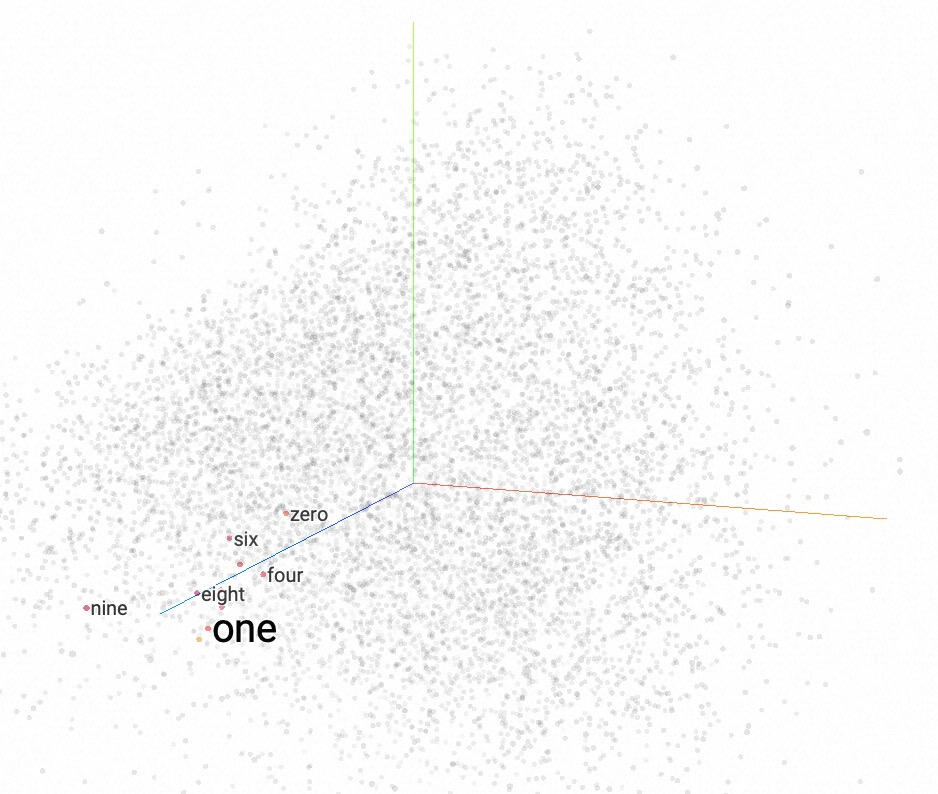
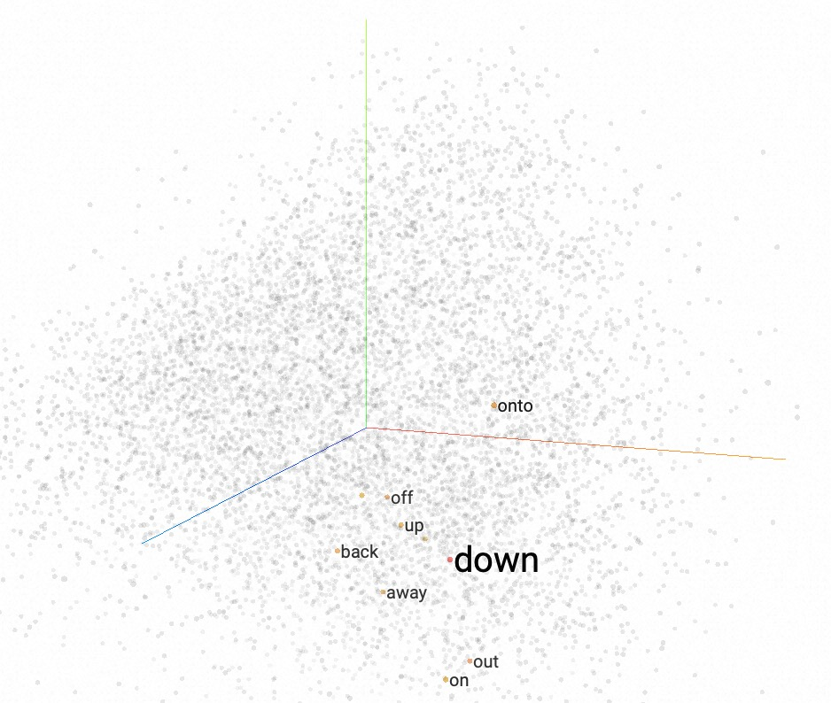
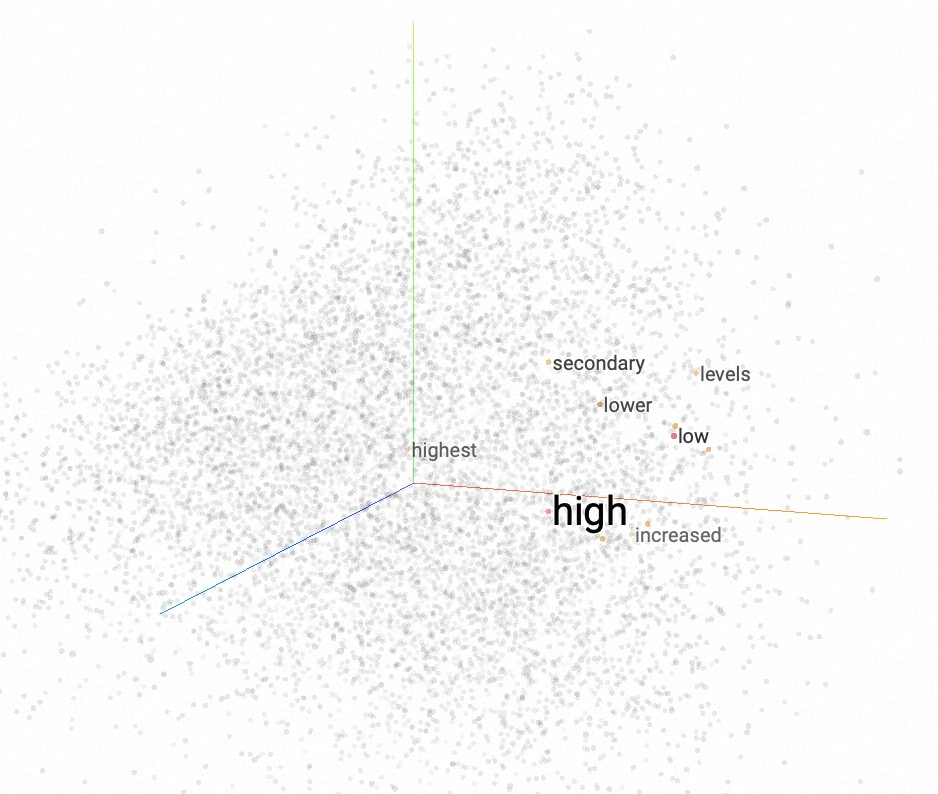
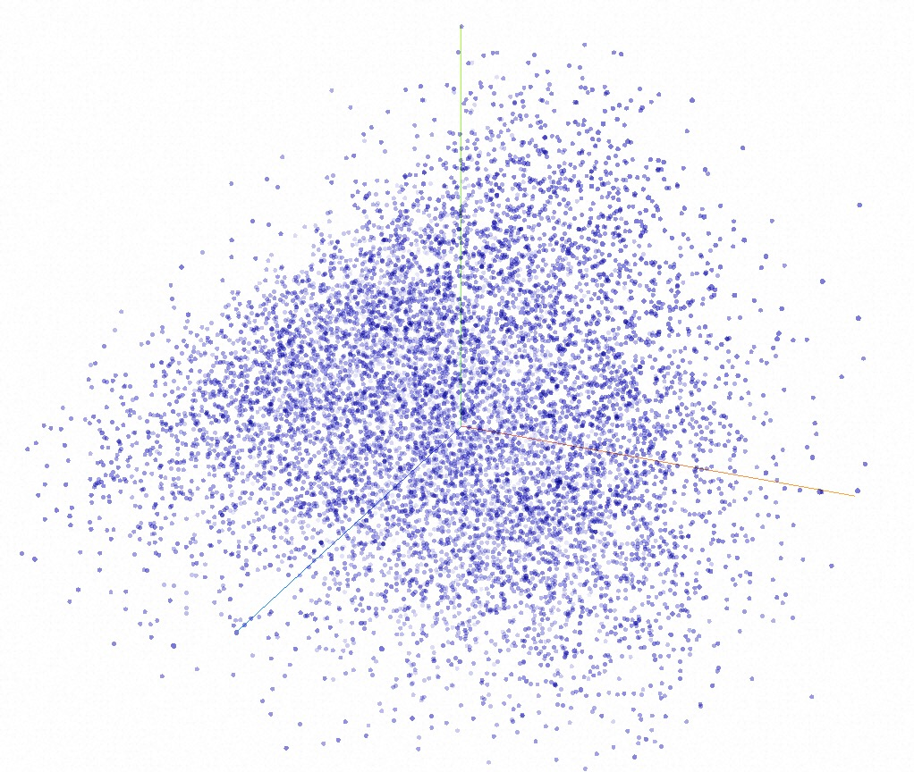
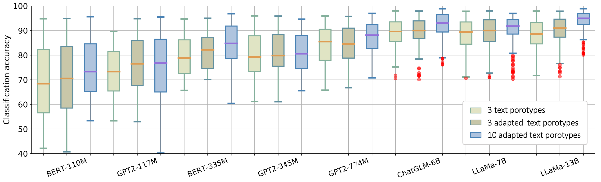
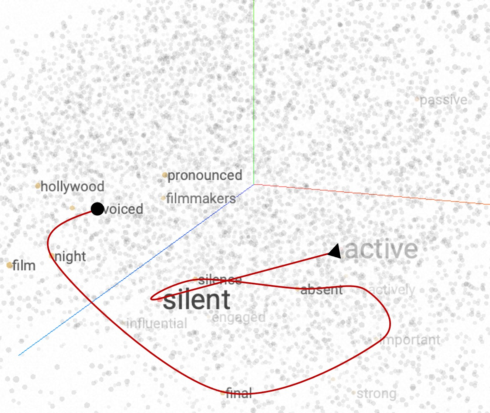
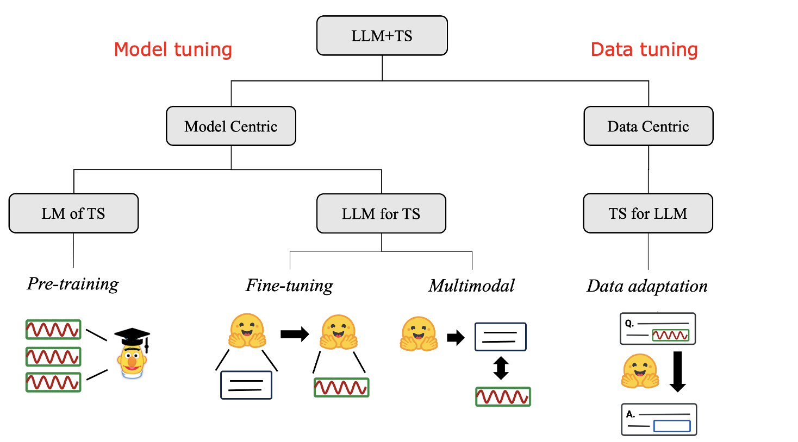
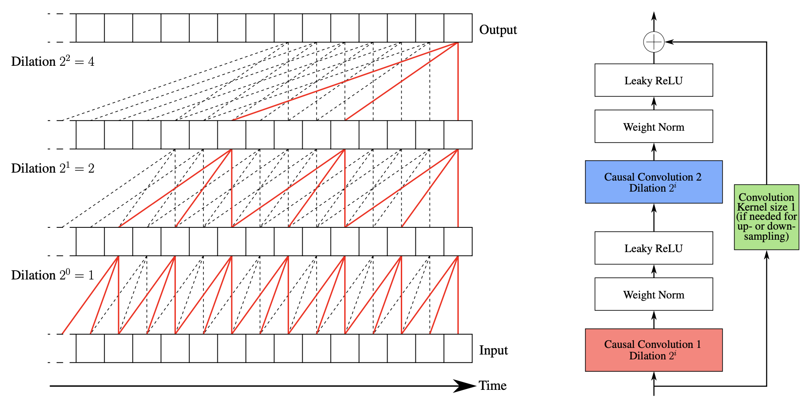
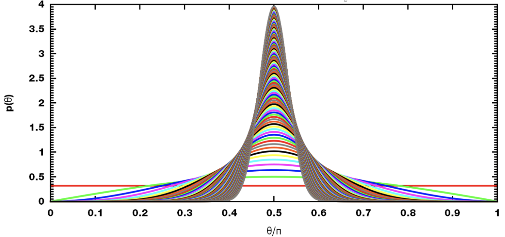

# TEST: TEXT PROTOTYPE ALIGNED EMBEDDING TO ACTIVATE LLM’S ABILITY FOR TIME SERIES

Chenxi Sun1,2,3, Hongyan Li1,2,3,4,∗, Yaliang Li5, Shenda Hong6,7,∗

Published as a conference paper at ICLR 2024

National Key Laboratory of General Artificial Intelligence, Peking University 2Key Laboratory of Machine Perception
(Ministry of Education), Peking University 3School of Intelligence Science and Technology, Peking University 4PKU-WUHAN
Institute for Artificial Intelligence 5Alibaba Group 6National Institute of Health Data Science, Peking University
7Institute of Medical Technology, Health Science Center of Peking University {chenxi sun,leehy}@pku.edu,cn
yaliang.li@alibaba-inc.com, hongshenda@pku.edu.cn

arXiv:2308.08241v2 [cs.CL] 22 Feb 2024

## ABSTRACT

This work summarizes two ways to accomplish Time-Series (TS) tasks in today’s Large Language Model (LLM) context: LLM-
for-TS (model-centric) designs and trains a fundamental large model, or fine-tunes a pre-trained LLM for TS data; TS-
for-LLM (data-centric) converts TS into a model-friendly representation to enable the pre-trained LLM to handle TS data.
Given the lack of data, limited resources, semantic context requirements, and so on, this work focuses on TSfor-LLM,
where we aim to activate LLM’s ability for TS data by designing a TS embedding method suitable for LLM. The proposed
method is named TEST. It first tokenizes TS, builds an encoder to embed TS via instance-wise, feature-wise, and text-
prototype-aligned contrast, where the TS embedding space is aligned to LLM’s embedding layer space, then creates soft
prompts to make LLM more open to that embeddings, and finally implements TS tasks using the frozen LLM. We also
demonstrate the feasibility of TS-for-LLM through theory and experiments. Experiments are carried out on TS
classification, forecasting, and representation tasks using eight frozen LLMs with various structures and sizes. The
results show that the pre-trained LLM with TEST strategy can achieve better or comparable performance than today’s SOTA
TS models and offer benefits for few-shot and generalization. By treating LLM as the pattern machine, TEST can endow
LLM’s ability to process TS data without compromising language ability. We hope that this study will serve as a
foundation for future work to support TS+LLM progress.

## 1 INTRODUCTION

Implementing Time-Series (TS) tasks, such as medical, industrial, and meteorological, is a researchintensive field Sun
et al. (2020). The relevant models evolved from statistical models to RNNs, CNNs, and Transformers. Nowadays, we see a
fast growth and remarkable performances of Largescale pre-trained Language Models (LLM) in NLP and CV fields Zhao et al.
(2023). Consequently, it seems natural to inquire whether LLMs can be used for TS tasks. However, according to
experiments, most pre-trained LLMs have not made significant progress in relation to abstract TS.

In answer to this requirement, we envision two ways to achieve the paradigm of TS+LLM 1:

• LLM-for-TS (model-centric, modify LLM). For TS data, design and train a fundamental Large Model from scratch (LM-of-
TS), then fine-tune the model accordingly for various downstream tasks. Or, fine-tune the existing pre-trained LLM and
convert it from text tasks to TS tasks;

∗Corresponding authors 1This categorization focuses on the requirement for changing the model. But from technology,
LLM+TS can be achieved by pre-training, fine-tuning, tool-augmented methods, external encoders, and their ensemble.

1

Published as a conference paper at ICLR 2024

• TS-for-LLM (data-centric, modify TS). Based on the existing LLMs, furthest freezing them, design some mechanisms to
customize TS for them by creating LLM-friendly TS representation.

We acknowledge that the first way, particularly developing and training a model from scratch, is the most essential
solution since pre-training is the crucial step of instilling knowledge to the model. And the second way is actually
challenging to break beyond the model’s original capabilities. However, in this work, we still focus on the second way
due to the following three considerations:

Data perspective. LLM-for-TS methods, especially when building a foundation model, necessitate large dataset, but TS is
professional, the largest dataset is less than 10GB, which is much smaller than that for NLP Zhou et al. (2023); TS-for-
LLM methods can use a relatively small dataset as its objective is solely to assist the existing LLM in inferring TS;
Model perspective. LLM-for-TS methods focus on vertical industries. Because of the major disparities in TS across
domains, various large models targeting medical TS, industrial TS, etc. must be built and trained from the start; TS-
for-LLM methods need little or even no training. By utilizing plug-in modules, it makes the utilization more general and
convenient; Usage perspective. LLM-for-TS methods are appropriate for instances involving specialists; TS-for-LLM
methods maintain LLM’s textual capabilities while providing rich complementing semantics, being easily accessible and
user-friendly.

Without changing the existing model, the most natural approach is treating TS as text data. For example, a possible
dialogue is: [Q] Diagnose if a patient has sepsis through the following mean arterial pressure sequence in mm Hg: 88,
95, 78, 65, 52, 30. [A] Yes. However, TS is often multivariate while text is univariate. For example, excepting mean
arterial pressure, dozens of vital signs, and laboratory values, such as heart rate, lactic acid, etc., need to be
included when diagnosing sepsis. One intuitive method is to divide a multivariate TS into multiple univariate sequences
and input them into LLM one by one. However, this will lead to three drawbacks. First, different prompt sentences, data
order, and connection statements will produce different results; Second, a long input sequence likely to make LLM
inefficient and hard to remember the previous univariate TS; Third, the crucial aspects of multivariate dependency in TS
will be ignored.

To address the above issues and achieve TS-for-LLM, we do not directly input TS into LLM, but instead, we first tokenize
TS, then design an encoder to embed them, finally skip the embedding layer to input them into LLM. In this way, the core
is to create embeddings that the LLM can understand.

High-quality TS embedding can be employed as the computational phenotype that the deep learning model can understand
Hong et al. (2023). To make the embedding understandable by language models. Most multimodal approaches use alignment,
for example, aligning text embedding and image embedding through text descriptions of the image Wang et al. (2023).
However, TS lacks visual cues and has an annotation bottleneck caused by its complex characteristics. Only a few
specific TS, such as ECG, have text descriptions in each segment, where the image-text matching route could be
implemented. But in most cases, it’s not feasible.

Contrastive Learning (CL) can avoid the annotation bottleneck through designing pretext tasks by utilizing intrinsic
information instead of relying on pre-defined prior knowledge. Currently, CL methods for TS data has also advanced Meng
et al. (2023b). These methods evaluate the effectiveness of TS embedding through follow-up classification, prediction,
or clustering models, such as SVM Franceschi et al. (2019b). However, these simple and newly-trained models are
considerably different from the complex and pre-trained LLM. The representation vector generated by unconstrained CL is
likely to deviate greatly from the LLM’s cognitive embedding space.

To address the above issues, we propose an embedding method for TimE Series tokens to align the Text embedding space of
LLM (TEST). Based on CL, TEST uses text embedding vectors as prototypes to constrain TS’ embedding space and highlights
feature-wise patterns. We show that TEST can activate LLM’s ability as pattern machine. The contributions of this work
are:

• Summarize two TS+LLM paradigms, LLM-for-TS, TS-for-LLM, with their potential methods; • Propose TEST for TS-for-LLM.
TEST can produce the similarity-based, instance-wise, featurewise, and text-prototype-aligned embedding for TS tokens.
We prove that prompt tuning is almost equivalent to supervised fine-tuning when TS embedding and word embedding are
aligned; • Experiments on TS classification, forecasting, few-shot, and representation tasks demonstrate that TEST can
activate LLM’s capability to archive TS tasks, where the random and unsatisfactory results produced by original LLMs can
be elevated to the baseline.

2

Category Means Pros Cons Work

LM-of-TS Training Specialized, Not universal, Pre-training Ma et al. (2023) accurate large datasets Earth transformer Bi
et al. (2023)

Tuning End-to-end, More experiments, GPT4TSZhou et al. (2023) accurate lose language ability LLM4TSChang et al. (2023)

PromptCast Xue & Salim (2023) Health Learner Liu et al. (2023) METS Li et al. (2024) Text2ECGChung et al. (2023)

LLM-for-TS

Tool augmented Parameter-efficient, less experiments Need experts, need annotation

TS-for-LLM External encoder Parameter-efficient, Weak robust TEST multiple abilities

Table 1: Existing Work about TS+LLM

As the name of TEST implies, it’s a forward-looking test that we hope to lay the groundwork for future study. And it
does give LLM new capabilities and highlight its qualities as a pattern machine.

## 2 RELATED WORK

### 2.1 TIME SERIES AND LARGE LANGUAGE MODEL

There hasn’t been much research done on TS+LLM because this field is still in its infancy. We summarize the existing
work in Table 1. LLM-for-TS with changing the model can be achieved through tuning or tool augmented means; TS-for-LLM
with changing the data can be achieved through building the external encoder.

LM-of-TS Ma et al. (2023) trains a fundamental and accurate model based on accumulated domain TS data, but it can be
difficult to construct a large well-labeled dataset due to data acquisition and annotation costs. By comparison,
Supervised Fine-Tuning (SFT) in LLM-for-TS Chang et al. (2023) has a relatively smaller workload than pre-training, but
it can make the LLM lose its language capabilities and its advantages over a sophisticated model designed specifically
for TS tasks are unclear. Regarding TS as the text sequence and using prompts as the augmented tool Liu et al. (2023)
could input numerical TS into LLM directly, but it is inaccurate, requires more experience, and will fail for
multivariate TS. The multimodal methods Li et al. (2024) could align the text and TS, but apart from ECG, most TS
datasets have no segment annotation.

### 2.2 TIME SEIRES EMBEDDING

TS embedding can provide identities by including typical, associated, and dependant attributes. CL-based methods can get
the data representation Chen et al. (2020), employing the instance discrimination pretext task to bring similar pairs
closer while pushing dissimilar pairs apart in the embedding space. Some efforts have been made to implement instance-
level contrast Woo et al. (2022b); Zheng et al. (2023), temporal-level contrast Meng et al. (2023c); Franceschi et al.
(2019b), and clustering-level contrast Meng et al. (2023a) on TS data, with promising results. However, the direct
contrast cannot bridge TS embedding and the LLM’s comprehensible space. In our setting, we prefer to freeze the pre-
trained LLM and let the embedding compromise. That is, we use the text token embedding in LLM to limit and guide the TS
token embedding.

Inspired by the prototype-level contrast Caron et al. (2020a), which goes beyond the independence assumption and
exploits latent cluster information present within samples. We can select some text embeddings as basic prototypes to
lead the learning. However, in addition to the alignment, we still need to consider issues of prototype selection,
differentiation Meng et al. (2023c), uniformity Wang & Isola (2020), stability Huang et al. (2023) and etc.

## 3 METHODS

TEST has two key steps: In Figure 1, build an encoder to embed TS; In Figure 2, create prompts to make the LLM can
accept TS embeddings as input.

3

Published as a conference paper at ICLR 2024

Augmentation

Autoencoding Feature matrix

Decoder

Negative

Positive

Anchor

Similarity

Projector

Instance contrast

Text prototype

Feature contrast

Shape

Frequency

Text alignment

Value

Value

9 Shape up

Value

Shape

Frequency

down

1

Figure 1: Text-prototype-aligned TS Embedding by Instance-wise and Feature-wise Contrast

### 3.1 TS TOKEN AUGMENTATION AND ENCODING

Definition 1 (Token Embedding of Time Series) A multivariate time series x = {xd t }T,D t=1,d=1 has D variables and T
time points. It can be segmented to a list of K non-overlapping subsequences s = {sk}K k=1 by a segmentation function fs
: x → s, where the length of sk = xti:tj is arbitrary, 1 ≤ ti < tj ≤ T. We call s as the token list of time series x.
Further, each token can be embeded to a M-dimensional representation space by an embedding function fe : sk ∈ RD×T → ek
∈ RM. Finally, the token embedding list of x is e = {ek}K k=1 = fe(s) = fe(fs(x)).

We first tokenize TS into some segmentation/subsequences/tokens/instances through the classical sliding window method in
representation learning Yue et al. (2022) s = fs(x). We define a TS token s as the anchor instance. Its positives s+ are
the augmented instances, sweak ∼Tweak (jitterand-scale strategy, adding random variations to the signal and scale up its
magnitude), sstrong ∼ Tstrong (permutation-and-jitter strategy, splitting the sequence into a random number of segments
and randomly shuffling them) Eldele et al. (2021b). Its negatives s− are from non-overlapping instances which do not
have the same subsequence as s.

After getting anchor-positive-negative, we built a neural network as the encoder to embed instance into vector e =
fe(s). We also trained a decoder fd by using the auto-encoding loss Lae = 1 N PN i=1 sim(s, fd(e)) to ensure the
representativeness of the embedding and subsequent verification. Because our primary goal is to retrieve the encoder,
this decoder can likewise be unbuilt without harming the future process.

### 3.2 INSTANCE-WISE AND FEATURE-WISE CONTRAST

The basic instance-wise CL treats each instance independently and design the instance discrimination pretext task to
keep similar instances close and dissimilar instances far away. To prevent embedding space collapse, we treat augmented
views of the same instance as the unique positive pair, and all remaining ones within the B size minibatch as negative
pairs He et al. (2020). The instance-wise contrastive loss is shown in Equation 1. Where given the instance embedding e,
e+/−, we construct a projection head fp, which is a one-layer MLP to obtain fp(e). σ(e, e+/−) is used to calculate the
similarity between two projected vectors through a similarity function sim like cosine similarity with the instance-
level temperature parameter τ.

Lins = −log exp(σ(e, e+))

exp(σ(e, e+)) + PB i=1 exp(σ(e, e− i ))

(1)

σ(e, e+/−) = sim(fp(e), fp(e+/−))

τ

4

Published as a conference paper at ICLR 2024

We also propose a feature-wise contrast method to break the independence between instances. As shown in Figure 1, after
embedding, a feature matrix RB×M is formed by the representation vectors of instances in a minibatch. Where each row is
an embedding of a instance, thus rows could be regarded as soft labels of instances which are used in Equation 1. In
addition to rows, columns of feature matrix also have semantic information. Li et al. (2021c) proposed that the columns
could be further regarded as cluster representations. However such cluster-wise methods require prior knowledge to pre-
specify the number of clusters, which is non-trivial for the unlabeled TS data in this work. Thus, we propose to regard
the columns as the soft labels of features and perform discrimination between groups of similar features.

For an anchor feature matrix m, where m is the B-th row copy of the vector e, we obtain a positive feature matrix m+ and
a negative feature matrix m−, where m+/− = [ei]B i=1 ∈ RB×M. We mark the columns in the matrix as m ∈ mT. As expressed
by the item before the right arrow in the Equation 2, the feature-wise contrast mainly align and differentiate the same
feature column among the positive and negative. However, this may cause the representation space to shrink within a
small area. We find that ensuring differences between features can better address this issue. That is, we suggest the
contrast between different feature columns as shown in the item after the right arrow.

M X

M X

i=1 log exp(σ(mi, m+ i )) PM j=1[exp(σ(mi, m+ j )) + exp(σ(mi, m− j ))] | {z } Feature category uniformity

−σ(mi, m− i ) | {z } Difference

i=1 (σ(mi, m+ i ) | {z } Alignment

Lfea = −

) ⇒−

(2)

More importantly, the injection of feature column differences can also greatly assist in the subsequent implementation
of text-prototype-aligned contrast. Because that contrast will apply the selected text token embedding to the feature
columns, like coordinate axes.

### 3.3 TEXT-PROTOTYPE-ALIGNED CONTRAST

The pre-trained LLM has its own token embedding, e.g., small, medium, and big GPT-2 embed text tokens from word
dictionaries into representation spaces with 768, 1024, and 1280 dimensions. Naively, we can align the token embedding
of TS and text using the similarity estimation. Although TS tokens lack text annotation, we can place their embedding
near typical text descriptions of TS, such as value, shape, and frequency. In this fashion, it is intuitively expected
that various TS tokens can represent various descriptive terms such as small, big, up, down, stable, fluctuating, and so
on. Naturally, the example above is based on the closest neighbor principle because the embedding space of a text token
is discrete, akin to a vector table, but that of our TS token is continuous.

However, of course, the actual outcomes will not match what we expect because we are not providing the supervised label
or ground truth. For example, the embedding of a subsequence with an upward trend may be very close to that of a decline
word, or even that does not describe the trend. But it is irrelevant whether semantics can be understood by us. As
usual, the fact is that humans cannot comprehend the model’s perceptual mode.

Recently, researchers proved that LLMs are pattern machines Mirchandani et al. (2023). Thus, in this work, we achieve
“TS → pattern → text” to activate LLM’s ability for TS tasks. The choice of text prototype can be relaxed, not
necessarily the description related to TS.

In this work, we choose P representative text embedding tp as pivots/prototypes, and map TS embedding to them. In high
dimensional space, almost all vectors are pairwise orthogonal Hopcroft & Kannan (2013), thus the number of prototypes
rather than the type does matter, and their differences can be reflected in a single dimension/feature. Thus, the
modeling function of the text prototype tp is realized by feature-wise contrast. As expressed by Equation 3, the
alignment term guarantees that the two space ranges are roughly the same through the similarity constraint, the contrast
term uses tp as the coordinate axis to map the TS embedding, making the representation values in text coordinate axes of
similar instance similar. The feature matrix is no longer obtained through the projector but through the prototype
mapping e · tp → m.

P X

−Lfea(e · tp, e+ · tp, e− · tp)] | {z } Text contrast

Ltext = −

i=1 [sim(tpi, e) | {z } Text alignment

(3)

5

Published as a conference paper at ICLR 2024

### 3.4 LEARNABLE PROMPT EMBEDDING

Even TS has been described using an embedded representation that the LLM can understand, LLM still has to be instructed
on how to do subsequent TS tasks.

Prompt engineering like template and chain-of-thought is intuitive. Their contexts are coherent in human semantics, but
a TS embedding list has no human semantics, it is more about a pattern sequence. Thus, to create a more consistent
prompt pattern, we train a soft prompt by p-tuning Lester et al. (2021) make LLM be easier to understand the input.
These soft prompts are task-specific embedding, learning through the loss from LLM’s output and task ground truth in
Equation 4.

|Trainable layer|Language model|
|---|---|

|Soft prompt|embedding&lt;br&gt;…&lt;br&gt;TS|
|---|---|

Classification

TS embedding

Soft prompt

Classifier

[cls]

…

Encoder

Decoder

Lpromp = Lreg/cls(concat(pe, e)) (4)

Regression

Question Answer

Token

GPT4TS Zhou et al. (2023)has proved the feasibility that SFT can make LLM apply to TS. Based on this, we demonstrate the
feasibility of TEST by proving the equivalence between soft prompt and SFT.

Train

Fine-tune Fine-tune

Figure 2: Framework of LLM for TS Tasks

Consider a conditional generation task where the input x is a context and the output y is a sequence of tokens. Assume
an autoregression LLM pϕ(y|x) with parameter ϕ, z = [x; y]. The inference of a pre-trained LLM is computing hi as a
function of zi and the past activations in its left context, Y = LMϕ(zi, hi). The past hi in

the soft prompt turning with prompt peθ is hi = peθ[i, :], if i ∈ peidx LMϕ(zi, hi), otherwise . The SFT from LLM

to TS-LLM is Equation 5. Its transformation shows that the soft prompt tuning is approximately equivalent to SFT.

i∈Yidx log pϕ(z′ i|h<i) = X

X

max ϕ pϕ(y′|x) = max ϕ

i∈Yidx log pϕ+∆(zi + δzi|h<i)

≈ X

i∈Yidx log pϕ(zi|h<i) · X

i∈peidx log p∆(δzi|h<i)

(5)

= X

) · X

i∈Yidx log pϕ(zi| fe(s) | {z } Text−TS alignment | {z } Frozen LLM

i∈peidx log p∆(δzi|h<i)

| {z } Prompt peθ

Equation 5 also suggests that the projection space of TS tokens should preferably cover the complete set of text
embedding space. Thus, we utilize clustering to find P representative text prototypes. The process of using LLM to infer
TS is shown in Figure 2. In this framework, the text data is input into the embedding layer of LLM, while the prompts
and TS embeddings skip this layer.

## 4 EXPERIMENTS

The core of TEST is to train an encoder fe and a soft prompt pe as described in Algorithm 1. The encoder must can
extract relevant information from TS, needs to be time- and memory-efficient, and has to allow variable-length inputs.
Thus, we build a causal TCN with 10 layers of convolution blocks. Each convolution block is a sequence of GELU,
DilatedConv, BatchNorm, GELU, DilatedConv, with skip connections across each block. The DilatedConvs have dilation of 2i
in each layer i of convolution block. A final convolution block is used to map the hidden channels to the output channel
whose size is the same as the LLM’s embedding size.

6

Published as a conference paper at ICLR 2024

Algorithm 1 Training TEST

9: for e in epochs do 10: // UPDATE PROMPT 11: pe = pe − η▽θpeLpromp 12: // FINE TUNE DECODER (OPTIMAL) 13: θfd = θfd −
η′▽θfd Lreg 14: // UPDATE CLASSIFIER (OPTIMAL) 15: θfc = θfc − η▽θfc Lcls 16: end for

1: for e in epochs do 2: // UPDATE ENCODER 3: θfe = θfe − η▽θfe (Lins + Ltext) 4: // UPDATE DECODER (OPTIMAL) 5: θfd =
θfd − η▽θfd Lae 6: // UPDATE PROJECTOR 7: θfp = θfp − η▽θfp Lins 8: end for

Model Size Embed. dimension

The used LLMs are as listed in Table 2. Each encoder and soft prompt of LLM are trained using the Adam optimizer on 20
NVIDIA Tesla V100-SXM2 GPU with CUDA 11.3.

Bert Devlin et al. (2018) 110M, 335M 748, 1024 GPT2 Radford et al. (2019) 117M, 345M, 774M 768, 1024, 1280 ChatGLM Du et
al. (2022) 6B 4096 LLaMa2 Touvron et al. (2023) 7B, 13B 4096

Table 2: The Used Language Model

We compare our method to 5 kinds of methods including 12 baselines: 1) LLM-QA methods Xue & Salim (2023); Liu et al.
(2023) with the classification template Classify the given [domain] sequence as either [class label] or [class label]:
[numerical sequence]. [A] and the forecasting template [Q] Forecast the next value of the given [domain] sequence:
[numerical sequence]. [A]; 2) SFT LLMfor-TS method GPT4TS Zhou et al. (2023); 3) classical TS models DWT, DWTD Bagnall
et al. (2018), 1NNED, and TCN Tan et al. (2021); 4) SOTA TS models Informer Zhou et al. (2021), DLinear Zeng et al.
(2023), and TimesNet Wu et al. (2023); 5) SOTA CL-based TS models Tloss Franceschi et al. (2019b), TS2Vec Yue et al.
(2022), and CoST Woo et al. (2022a).

The overall results are shown in Figure 3 (The appendix has more compared classical SOTA models and detailed results
about long-term, short-term, few-shot, and zero-shot forecasting, multivariate time series classification, and
representation tasks.). Overall, after using TEST, when the size of LLM reaches about 300M, their accuracy comparable to
SOTA model.

### 4.1 CLASSIFICATION

We present accuracy scores for all 128 kinds of univariate TS datasets in UCR archive Dau et al. (2019) and all 30 kinds
of multivariate TS datasets in UEA archive Bagnall et al. (2018).

Accuracy. In Figure 3 (a-b), TEST makes the classification accuracy of LLM increase significantly. LLM’s original
classification performances are demonstrated through two QA results. It almost guesses the classification labels at
random, especially for multivariate TS. After using TEST, GPT2774M, which has the median accuracy among all models, can
improve accuracy by at least 18% for univariate TS and 25% for multivariate TS. TEST makes most LLMs comparable to, if
not better than, the existing models. When the size reaches about 300M, the accuracy can exceed TS baselines; When the
size reaches about 700M, the accuracy can exceed SOTA TS transformers.

Ablation. In Figure 3 (c-d), different text prototypes will lead to different results. We set 3 groups of text
prototypes: embeddings of value, shape, frequency, and embeddings of 3 or 10 cluster centers. Choosing a prototype group
that more accurately represents LLM’s entire text embedding space can improve the performance. This is also suggested by
Equation 5. Different prompt types, initialization, and length will lead to different results. We compare the soft
prompt with the hard prompt of Classify the given [domain] sequence as either [class label] or [class label]: [TS
embedding]. The accuracy differs by at least 10%. We set random initialization from uniform distribution and task
description initialization from Classify the given sequence. The latter makes the training converge faster. When the
model reaches 1B, a prompt length of 10 can achieve excellent results.

### 4.2 FORECASTING

We present short-forecasting MSE scores for all 19 kinds of varied time series datasets in TSER archive Tan et al.
(2021), and long-forecasting MSE scores for 8 popular real-world benchmark datasets including weather, traffic,
electricity, ILI, and ETT from Wu et al. (2023).

7

Published as a conference paper at ICLR 2024

|Published as a conference paper at ICLR 2024|Col2|
|---|---|
|||
|Univariate Classification&lt;br&gt;Multivariate&lt;br&gt;Classification&lt;br&gt;Shot&amp;#45;term&lt;br&gt;Forecasting&lt;br&gt;Long&amp;#45;term Forecasting&lt;br&gt;Few&amp;#45;shot||
|Univariate Classification&lt;br&gt;Multivariate&lt;br&gt;Classification&lt;br&gt;Shot&amp;#45;term&lt;br&gt;Forecasting&lt;br&gt;Long&amp;#45;term Forecasting&lt;br&gt;Few&amp;#45;shot|&lt;br&gt;&lt;br&gt;𝑒|
|Univariate Classification&lt;br&gt;Multivariate&lt;br&gt;Classification&lt;br&gt;Shot&amp;#45;term&lt;br&gt;Forecasting&lt;br&gt;Long&amp;#45;term Forecasting&lt;br&gt;Few&amp;#45;shot|Classical&lt;br&gt;SOTA models&lt;br&gt;QA&lt;br&gt;𝑓|
|Univariate Classification&lt;br&gt;Multivariate&lt;br&gt;Classification&lt;br&gt;Shot&amp;#45;term&lt;br&gt;Forecasting&lt;br&gt;Long&amp;#45;term Forecasting&lt;br&gt;Few&amp;#45;shot||
|Univariate Classification&lt;br&gt;Multivariate&lt;br&gt;Classification&lt;br&gt;Shot&amp;#45;term&lt;br&gt;Forecasting&lt;br&gt;Long&amp;#45;term Forecasting&lt;br&gt;Few&amp;#45;shot|SOTA models&lt;br&gt;QA&lt;br&gt;SFT&lt;br&gt;𝑔|
|Univariate Classification&lt;br&gt;Multivariate&lt;br&gt;Classification&lt;br&gt;Shot&amp;#45;term&lt;br&gt;Forecasting&lt;br&gt;Long&amp;#45;term Forecasting&lt;br&gt;Few&amp;#45;shot|Classical&lt;br&gt;SOTA models&lt;br&gt;|
|Univariate Classification&lt;br&gt;Multivariate&lt;br&gt;Classification&lt;br&gt;Shot&amp;#45;term&lt;br&gt;Forecasting&lt;br&gt;Long&amp;#45;term Forecasting&lt;br&gt;Few&amp;#45;shot|SOTA models&lt;br&gt;QA&lt;br&gt;SFT&lt;br&gt;~~ℎ~~|

UCR classification accuracy UCR classification accuracy

UCR classification accuracy

UCR classification accuracy

using representation

𝑖 𝑑

|𝑑|on accura sentation|
|---|---|
||Embedding before / after inputting LLM (ours)  + SVM&lt;br&gt;UCR classificati&lt;br&gt;using repres|
|||

Embedding before / after inputting LLM (ours) + SVM CL models + SVM

Figure 3: Experiment Results. (a-d) shows the classification results; (e-h) shows the forecasting results; (i) shows the
representation results. The red dashed line represents the best result.

Accuracy. In Figure 3 (e-f), TEST makes the forecasting accuracy of LLM increase significantly and comparable to SOTA
models. When the size reaches about 300M, the accuracy can exceed SOTA TS transformers.

Generalization. We fuse 19 datasets into 1 dataset and test the method on this fused dataset. As shown in Figure 3 (g),
compared with baselines, LLM-based models have better generality.

Few-shot. LLM has demonstrated remarkable performance in few-shot learning. Based on the settings in Zhou et al. (2023),
we present few-shot forecasting for 10% time steps in training datasets. As shown in Figure 3 (h), TEST achieves the
best performance and demonstrates a relative average MSE reduction of 23.5%.

8

Published as a conference paper at ICLR 2024

|Active silence silent absent important final night voiced|Col2|Col3|Col4|Col5|Col6|Col7|Col8|
|---|---|---|---|---|---|---|---|
|||||||||
|Whiteimportant change loop happy actively limit finally|Whiteimportant change loop happy actively limit finally|Whiteimportant change loop happy actively limit finally|Whiteimportant change loop happy actively limit finally|Whiteimportant change loop happy actively limit finally|Whiteimportant change loop happy actively limit finally|Whiteimportant change loop happy actively limit finally|Whiteimportant change loop happy actively limit finally|
|||||||||

### 4.3 REPRESENTATION

Representation learning. Learning universal representations for TS is a fundamental but challenging problem. Both TEST’s
first step (creating TS embedding) and second step (LLM’s output) can achieve this task. Based on the classical
representation learning task, we evaluated the effectiveness of TEST representation using SVM classifier on UCR dataset.
Note that using a simple classifier can better reflect the presentation effect. In Figure 3 (i), the embedding in TEST’s
first step is comparable to SOTA representation methods, and the embedding in TEST’s second step can outperform them.
This indicates that after using LLM, the representation of TS becomes more discriminative.

Figure 4: Matching TS Embedding to Words

Case. We use nearest neighbor method to find the text that a TS token matches to in the word embedding space of frozen
LLM. In Figure 4, the majority of the identified words are sentimentrelated adjectives and nouns. We speculate that by
prompting, the model will treat TS classification task as an sentiment classification task. Thus, introducing prompt is
like introducing a shortcut for LLM. Besides, the matched words are like a kind of textual Shapelet for TS segmentation,
representing TS through a series of patterns. Instead of regarding TS as a sequence of numbers, we suggest using words
to identify patterns in TS as LLMs without SFT are not good for math when performing digital tasks, but they are good at
extracting knowledge as a pattern machine. The semantics of the patterns be perplexing to us, but it makes sense to LLM.

## 5 DISCUSSION AND CONCLUSION

This paper proposes an instance-wise, feature-wise, and text-prototype-aligned TS embedding method to achieve TS-for-
LLM. It can activate LLM’s ability for TS tasks while maintaining its original language ability. Experiments on
classification, forecasting, and representation tasks show that using TEST, LLM can archive comparable performance to
SOTA methods.

TS-for-LLM can enrich LLM’s capabilities. SFT LLM may be more effective than TS-for-LLM, yet its superiority over
customized TS models remains unclear; Training customized models may be more accurate in TS tasks, yet TS-for-LLM offers
all notable benefits of LLM additionally.

TS-for-LLM can explore LLM’s mechanism as a pattern machine. The essence of TS-for-LLM is: TS ↔ TS embeddings ↔ patterns
↔ text/word embedding ↔ text. Although TEST gives the impression of a forcibly aligning operations between TS and text,
it dose convert TS into an understandable pattern sequence for LLMs, that clearly demonstrates that the essence of LLM
is pattern recognition. In fact, TS is objective data, whereas images, text, and speech are subjective data that can be
perceived by human senses. TEST aligns objective TS data and subjective text data at the machine level, but how to align
them at the human perception level requires future research.

Meanwhile, in addition to text prototypes and prompts, LLM size and type also affect the results. The impact of model
type is intuitive, it is related to downstream tasks, where the bidirectional structure is beneficial for
classification, and the generated structure is beneficial for forecasting. The impact of model size, where a larger
model produces more accurate results, can be attributed to various reasons. Aside from the impact of additional
parameters, we believe that the datasets used in the pre-training process are also important, with the size, diversity,
and corpus type all having an impact. We conjecture that more training data will provide the model with more
opportunities to learn temporal patterns. As a result, we intend to conduct more experiments to investigate deeper
correlations between corpora and TS data Chen et al. (2023).

## ACKNOWLEDGMENTS

This work is supported by National Natural Science Foundation of China (No.62172018, No.62102008) and Wuhan East Lake
High-Tech Development Zone National Comprehensive Experimental Base for Governance of Intelligent Society.

9

Published as a conference paper at ICLR 2024

## REFERENCES

Anthony J. Bagnall, Hoang Anh Dau, Jason Lines, Michael Flynn, James Large, Aaron Bostrom, Paul Southam, and Eamonn J.
Keogh. The UEA multivariate time series classification archive, 2018. CoRR, abs/1811.00075, 2018.

Kaifeng Bi, Lingxi Xie, Hengheng Zhang, Xin Chen, Xiaotao Gu, and Qi Tian. Accurate mediumrange global weather
forecasting with 3d neural networks. Nature, pp. 1476–4687, 2023. doi: 10.1038/s41586-023-06545-z.

Aaron Bostrom, Anthony Bagnall, Eamonn Keogh, Hoang Anh Dau, James Large, Jason Lines, Michael Flynn, and Paul Southam.
The uea multivariate time series classification archive, 2018, 2018.

Eoin Brophy, Zhengwei Wang, Qi She, and Tom´as Ward. Generative adversarial networks in time series: A systematic
literature review. ACM Comput. Surv., 55(10):199:1–199:31, 2023.

Mathilde Caron, Ishan Misra, Julien Mairal, Priya Goyal, Piotr Bojanowski, and Armand Joulin. Unsupervised learning of
visual features by contrasting cluster assignments. In Hugo Larochelle, Marc’Aurelio Ranzato, Raia Hadsell, Maria-
Florina Balcan, and Hsuan-Tien Lin (eds.), Advances in Neural Information Processing Systems, 2020a.

Mathilde Caron, Ishan Misra, Julien Mairal, Priya Goyal, Piotr Bojanowski, and Armand Joulin. Unsupervised learning of
visual features by contrasting cluster assignments. 2020b.

CDC. Illness. 2021. doi: https://gis.cdc.gov/grasp/fluview/fluportaldashboard.html.

Ching Chang, Wen-Chih Peng, and Tien-Fu Chen. LLM4TS: two-stage fine-tuning for time-series forecasting with pre-trained
llms. CoRR, abs/2308.08469, 2023.

Daoyuan Chen, Yilun Huang, and et al. Data-juicer: A one-stop data processing system for large language models. CoRR,
abs/2309.0203, 2023.

Ting Chen, Simon Kornblith, Mohammad Norouzi, and Geoffrey E. Hinton. A simple framework for contrastive learning of
visual representations. In Proceedings of International Conference on Machine Learning, volume 119, pp. 1597–1607, 2020.

Hyunseung Chung, Jiho Kim, Joon-Myoung Kwon, Ki-Hyun Jeon, Min Sung Lee, and Edward Choi. Text-to-ecg: 12-lead
electrocardiogram synthesis conditioned on clinical text reports. In IEEE International Conference on Acoustics, Speech
and Signal Processing, pp. 1–5, 2023.

Hoang Anh Dau, Anthony Bagnall, Kaveh Kamgar, Chin-Chia Michael Yeh, Yan Zhu, Shaghayegh Gharghabi, Chotirat Ann
Ratanamahatana, and Eamonn Keogh. The ucr time series archive. IEEE/CAA Journal of Automatica Sinica, 6:1293–1305, 2019.
doi: 10.1109/JAS.2019.1911747.

Angus Dempster, Daniel F. Schmidt, and Geoffrey I. Webb. Minirocket: A very fast (almost) deterministic transform for
time series classification. In ACM SIGKDD Conference on Knowledge Discovery and Data Mining, pp. 248–257, 2021. doi:
10.1145/3447548.3467231.

Jacob Devlin, Ming-Wei Chang, Kenton Lee, and Kristina Toutanova. BERT: pre-training of deep bidirectional transformers
for language understanding. CoRR, abs/1810.04805, 2018.

Jiaxiang Dong, Haixu Wu, Haoran Zhang, Li Zhang, Jianmin Wang, and Mingsheng Long. Simmtm: A simple pre-training
framework for masked time-series modeling. CoRR, abs/2302.00861, 2023.

Zhengxiao Du, Yujie Qian, Xiao Liu, Ming Ding, Jiezhong Qiu, Zhilin Yang, and Jie Tang. Glm: General language model
pretraining with autoregressive blank infilling. In Proceedings of Annual Meeting of the Association for Computational
Linguistics, volume 1, pp. 320–335, 2022.

Emadeldeen Eldele, Mohamed Ragab, Zhenghua Chen, Min Wu, Chee Keong Kwoh, Xiaoli Li, and Cuntai Guan. Time-series
representation learning via temporal and contextual contrasting. In Proceedings of the Thirtieth International Joint
Conference on Artificial Intelligence, pp. 2352– 2359, 2021a.

10

Published as a conference paper at ICLR 2024

Emadeldeen Eldele, Mohamed Ragab, Zhenghua Chen, Min Wu, Chee Keong Kwoh, Xiaoli Li, and Cuntai Guan. Time-series
representation learning via temporal and contextual contrasting. In International Joint Conference on Artificial
Intelligence, pp. 2352–2359, 2021b.

Jean-Yves Franceschi, Aymeric Dieuleveut, and Martin Jaggi. Unsupervised scalable representation learning for
multivariate time series. In Advances in Neural Information Processing Systems, pp. 4652–4663, 2019a.

Jean-Yves Franceschi, Aymeric Dieuleveut, and Martin Jaggi. Unsupervised scalable representation learning for
multivariate time series. In Advances in Neural Information Processing Systems, pp. 4652–4663, 2019b.

Ge Gao, Qitong Gao, Xi Yang, Miroslav Pajic, and Min Chi. A reinforcement learning-informed pattern mining framework for
multivariate time series classification. In Proceedings of International Joint Conference on Artificial Intelligence,
pp. 2994–3000, 2022. doi: 10.24963/IJCAI.2022/415.

Jean-Bastien Grill, Florian Strub, Florent Altch´e, Corentin Tallec, Pierre H. Richemond, Elena Buchatskaya, Carl
Doersch, Bernardo ´Avila Pires, Zhaohan Guo, Mohammad Gheshlaghi Azar, Bilal Piot, Koray Kavukcuoglu, R´emi Munos, and
Michal Valko. Bootstrap your own latent - A new approach to self-supervised learning. In Advances in Neural Information
Processing Systems, 2020.

Nate Gruver, Marc Finzi, Shikai Qiu, and Andrew Gordon Wilson. Large language models are zeroshot time series
forecasters. CoRR, abs/2310.07820, 2023. doi: 10.48550/ARXIV.2310.07820.

Kaiming He, Haoqi Fan, Yuxin Wu, Saining Xie, and Ross B. Girshick. Momentum contrast for unsupervised visual
representation learning. In Computer Vision and Pattern Recognition, pp. 9726–9735, 2020.

Shenda Hong, Hongyan Li, Chenxi Sun, and Junyuan Shang. Research and applications of extracting computational phenotype
from vital sign time series. China Seience and Technology Achivements, 10, 2023. doi:
10.3772/j.issn.1009-5659.223.10.002.

John Hopcroft and Ravindran Kannan. Computer science theory for the information age. Cambridge University press, 2013.

Zhizhong Huang, Jie Chen, Junping Zhang, and Hongming Shan. Learning representation for clustering via prototype
scattering and positive sampling. IEEE Trans. Pattern Anal. Mach. Intell., 45 (6):7509–7524, 2023. doi:
10.1109/TPAMI.2022.3216454.

Ming Jin, Shiyu Wang, Lintao Ma, Zhixuan Chu, James Y. Zhang, Xiaoming Shi, Pin-Yu Chen, Yuxuan Liang, Yuan-Fang Li,
Shirui Pan, and Qingsong Wen. Time-llm: Time series forecasting by reprogramming large language models. CoRR,
abs/2310.01728, 2023. doi: 10.48550/ARXIV. 2310.01728.

Fazle Karim, Somshubra Majumdar, Houshang Darabi, and Samuel Harford. Multivariate lstm-fcns for time series
classification. Neural Networks, 116:237–245, 2019. doi: 10.1016/J.NEUNET. 2019.04.014.

Salar Hosseini Khorasgani, Yuxuan Chen, and Florian Shkurti. SLIC: self-supervised learning with iterative clustering
for human action videos. In IEEE/CVF Conference on Computer Vision and Pattern Recognition, pp. 16070–16080, 2022. doi:
10.1109/CVPR52688.2022.01562.

Nikita Kitaev, Lukasz Kaiser, and Anselm Levskaya. Reformer: The efficient transformer. In International Conference on
Learning Representations, 2020.

Brian Lester, Rami Al-Rfou, and Noah Constant. The power of scale for parameter-efficient prompt tuning. In Proceedings
of Conference on Empirical Methods in Natural Language Processing, pp. 3045–3059, 2021. doi: 10.18653/v1/2021.emnlp-
main.243.

Guozhong Li, Byron Choi, Jianliang Xu, Sourav S. Bhowmick, Kwok-Pan Chun, and Grace LaiHung Wong. Shapenet: A shapelet-
neural network approach for multivariate time series classification. In AAAI Conference on Artificial Intelligence, pp.
8375–8383, 2021a. doi: 10.1609/AAAI.V35I9.17018.

11

Published as a conference paper at ICLR 2024

Jun Li, Che Liu, Sibo Cheng, Rossella Arcucci, and Shenda Hong. Frozen language model helps ecg zero-shot learning. In
Medical Imaging with Deep Learning, pp. 402–415, 2024.

Junnan Li, Pan Zhou, Caiming Xiong, and Steven C. H. Hoi. Prototypical contrastive learning of unsupervised
representations. In International Conference on Learning Representations, 2021b.

Yunfan Li, Peng Hu, Jerry Zitao Liu, Dezhong Peng, Joey Tianyi Zhou, and Xi Peng. Contrastive clustering. In AAAI
Conference on Artificial Intelligence,, pp. 8547–8555, 2021c.

Xin Liu, Daniel McDuff, Geza Kovacs, Isaac R. Galatzer-Levy, Jacob E. Sunshine, Jiening Zhan, Ming-Zher Poh, Shun Liao,
Paolo Di Achille, and Shwetak N. Patel. Large language models are few-shot health learners. CoRR, abs/2305.15525, 2023.
doi: 10.48550/arXiv.2305.15525.

Yong Liu, Haixu Wu, Jianmin Wang, and Mingsheng Long. Non-stationary transformers: Exploring the stationarity in time
series forecasting. In Advances in Neural Information Processing Systems, 2022.

Qianli Ma, Zhen Liu, Zhenjing Zheng, Ziyang Huang, Siying Zhu, Zhongzhong Yu, and James T. Kwok. A survey on time-series
pre-trained models. CoRR, abs/2305.10716, 2023. doi: 10.48550/ arXiv.2305.10716.

Qianwen Meng, Hangwei Qian, Yong Liu, Yonghui Xu, Zhiqi Shen, and Lizhen Cui. MHCCL: masked hierarchical cluster-wise
contrastive learning for multivariate time series. CoRR, abs/2212.01141, 2022.

Qianwen Meng, Hangwei Qian, Yong Liu, Lizhen Cui, Yonghui Xu, and Zhiqi Shen. MHCCL: masked hierarchical cluster-wise
contrastive learning for multivariate time series. In AAAI Conference on Artificial Intelligence, pp. 9153–9161, 2023a.
doi: 10.1609/aaai.v37i8.26098.

Qianwen Meng, Hangwei Qian, Yong Liu, Yonghui Xu, Zhiqi Shen, and Lizhen Cui. Unsupervised representation learning for
time series: A review. CoRR, abs/2308.01578, 2023b. doi: 10.48550/ arXiv.2308.01578.

Qianwen Meng, Hangwei Qian, Yong Liu, Yonghui Xu, Zhiqi Shen, and Lizhen Cui. Unsupervised representation learning for
time series: A review. CoRR, abs/2308.01578, 2023c.

Suvir Mirchandani, Fei Xia, Pete Florence, Brian Ichter, Danny Driess, Montserrat Gonzalez Arenas, Kanishka Rao, Dorsa
Sadigh, and Andy Zeng. Large language models as general pattern machines. In Conference on Robot Learning, volume 229 of
Proceedings of Machine Learning Research, pp. 2498–2518, 2023.

Yuqi Nie, Nam H. Nguyen, Phanwadee Sinthong, and Jayant Kalagnanam. A time series is worth 64 words: Long-term
forecasting with transformers. In International Conference on Learning Representations, 2023.

Boris N. Oreshkin, Dmitri Carpov, Nicolas Chapados, and Yoshua Bengio. N-BEATS: neural basis expansion analysis for
interpretable time series forecasting. In 8th International Conference on Learning Representations, ICLR 2020, Addis
Ababa, Ethiopia, April 26-30, 2020, 2020.

PeMS. Traffic. 2021. doi: http://pems.dot.ca.gov/.

Alec Radford, Jeff Wu, Rewon Child, David Luan, Dario Amodei, and Ilya Sutskever. Language models are unsupervised
multitask learners. OpenAI, 2019.

Patrick Sch¨afer and Ulf Leser. Multivariate time series classification with WEASEL+MUSE. CoRR, abs/1711.11343, 2017.

Vivek Sharma, Makarand Tapaswi, M. Saquib Sarfraz, and Rainer Stiefelhagen. Clustering based contrastive learning for
improving face representations. In IEEE International Conference on Automatic Face and Gesture Recognition, pp. 109–116,
2020. doi: 10.1109/FG47880.2020.00011.

Taylor SJ and Letham B. Forecasting at scale. In PeerJ Preprints, pp. 5:e3190v2, 2017. doi:
10.7287/peerj.preprints.3190v2.

12

Published as a conference paper at ICLR 2024

Chenxi Sun, Shenda Hong, and et al. A review of deep learning methods for irregularly sampled medical time series data.
CoRR, abs/2010.12493, 2020. doi: 10.48550/arXiv.2010.12493.

Chang Wei Tan, Christoph Bergmeir, Francois Petitjean, and Geoffrey I Webb. Time series extrinsic regression. Data
Mining and Knowledge Discovery, pp. 1–29, 2021. doi: https://doi.org/10.1007/ s10618-021-00745-9.

Sana Tonekaboni, Danny Eytan, and Anna Goldenberg. Unsupervised representation learning for time series with temporal
neighborhood coding. In International Conference on Learning Representations, 2021.

Hugo Touvron, Louis Martin, Kevin Stone, Peter Albert, Amjad Almahairi, and et al. Llama 2: Open foundation and fine-
tuned chat models. CoRR, abs/2307.09288, 2023.

A¨aron van den Oord, Yazhe Li, and Oriol Vinyals. Representation learning with contrastive predictive coding. CoRR,
abs/1807.03748, 2018.

Tongzhou Wang and Phillip Isola. Understanding contrastive representation learning through alignment and uniformity on
the hypersphere. In Proceedings of International Conference on Machine Learning, volume 119, pp. 9929–9939, 2020.

Xiao Wang, Guangyao Chen, Guangwu Qian, Pengcheng Gao, Xiao-Yong Wei, Yaowei Wang, Yonghong Tian, and Wen Gao. Large-
scale multi-modal pre-trained models: A comprehensive survey. Mach. Intell. Res., 20(4):447–482, 2023. doi:
10.1007/s11633-022-1410-8.

Wetterstation. Weather. 2017. doi: https://www.bgc-jena.mpg.de/wetter/.

Kristoffer Wickstrøm, Michael Kampffmeyer, Karl Øyvind Mikalsen, and Robert Jenssen. Mixing up contrastive learning:
Self-supervised representation learning for time series. Pattern Recognit. Lett., 155:54–61, 2022.

Gerald Woo, Chenghao Liu, Doyen Sahoo, Akshat Kumar, and Steven C. H. Hoi. Cost: Contrastive learning of disentangled
seasonal-trend representations for time series forecasting. In International Conference on Learning Representations,
2022a.

Gerald Woo, Chenghao Liu, Doyen Sahoo, Akshat Kumar, and Steven C. H. Hoi. Cost: Contrastive learning of disentangled
seasonal-trend representations for time series forecasting. In The International Conference on Learning Representations,
2022b.

Gerald Woo, Chenghao Liu, Doyen Sahoo, Akshat Kumar, and Steven C. H. Hoi. Etsformer: Exponential smoothing transformers
for time-series forecasting. CoRR, abs/2202.01381, 2022c.

Haixu Wu, Jiehui Xu, Jianmin Wang, and Mingsheng Long. Autoformer: Decomposition transformers with auto-correlation for
long-term series forecasting. In Advances in Neural Information Processing Systems, pp. 22419–22430, 2021.

Haixu Wu, Tengge Hu, Yong Liu, Hang Zhou, Jianmin Wang, and Mingsheng Long. Timesnet: Temporal 2d-variation modeling for
general time series analysis. In International Conference on Learning Representations, 2023.

Hao Xue and Flora D. Salim. Promptcast: A new prompt-based learning paradigm for time series forecasting. CoRR,
abs/2210.08964, 2023.

Ling Yang and Shenda Hong. Unsupervised time-series representation learning with iterative bilinear temporal-spectral
fusion. In International Conference on Machine Learning, volume 162 of Proceedings of Machine Learning Research, pp.
25038–25054, 2022.

Xinyu Yang, Zhenguo Zhang, and Rongyi Cui. Timeclr: A self-supervised contrastive learning framework for univariate time
series representation. Knowl. Based Syst., 245:108606, 2022.

Jinsung Yoon, Daniel Jarrett, and Mihaela van der Schaar. Time-series generative adversarial networks. In Advances in
Neural Information Processing Systems 32: Annual Conference on Neural Information Processing Systems 2019, NeurIPS 2019,
December 8-14, 2019, Vancouver, BC, Canada, pp. 5509–5519, 2019.

13

Published as a conference paper at ICLR 2024

Zhihan Yue, Yujing Wang, Juanyong Duan, Tianmeng Yang, Congrui Huang, Yunhai Tong, and Bixiong Xu. Ts2vec: Towards
universal representation of time series. In AAAI Conference on Artificial Intelligence, pp. 8980–8987, 2022.

Ailing Zeng, Muxi Chen, Lei Zhang, and Qiang Xu. Are transformers effective for time series forecasting? In AAAI
Conference on Artificial Intelligence, pp. 11121–11128, 2023. doi: 10. 1609/aaai.v37i9.26317.

George Zerveas, Srideepika Jayaraman, Dhaval Patel, Anuradha Bhamidipaty, and Carsten Eickhoff. A transformer-based
framework for multivariate time series representation learning. In ACM SIGKDD Conference on Knowledge Discovery and Data
Mining, pp. 2114–2124, 2021. doi: 10.1145/3447548.3467401.

Dejiao Zhang, Feng Nan, Xiaokai Wei, Shang-Wen Li, Henghui Zhu, Kathleen R. McKeown, Ramesh Nallapati, Andrew O. Arnold,
and Bing Xiang. Supporting clustering with contrastive learning. In Proceedings of Conference of the North American
Chapter of the Association for Computational Linguistics: Human Language Technologies, pp. 5419–5430, 2021. doi:
10.18653/V1/2021.NAACL-MAIN.427.

Xuchao Zhang, Yifeng Gao, Jessica Lin, and Chang-Tien Lu. Tapnet: Multivariate time series classification with
attentional prototypical network. In AAAI Conference on Artificial Intelligence, pp. 6845–6852, 2020. doi:
10.1609/AAAI.V34I04.6165.

Wayne Xin Zhao, Kun Zhou, Junyi Li, Tianyi Tang, Xiaolei Wang, Yupeng Hou, Yingqian Min, Beichen Zhang, Junjie Zhang,
Zican Dong, Yifan Du, Chen Yang, Yushuo Chen, Zhipeng Chen, Jinhao Jiang, Ruiyang Ren, Yifan Li, Xinyu Tang, Zikang Liu,
Peiyu Liu, Jian-Yun Nie, and JiRong Wen. A survey of large language models. CoRR, abs/2303.18223, 2023. doi: 10.48550/
arXiv.2303.18223.

Xiaochen Zheng, Xingyu Chen, Manuel Sch¨urch, Amina Mollaysa, Ahmed Allam, and Michael Krauthammer. Simts: Rethinking
contrastive representation learning for time series forecasting. CoRR, abs/2303.18205, 2023.

Haoyi Zhou, Shanghang Zhang, Jieqi Peng, Shuai Zhang, Jianxin Li, Hui Xiong, and Wancai Zhang. Informer: Beyond
efficient transformer for long sequence time-series forecasting. In AAAI Conference on Artificial Intelligence, pp.
11106–11115, 2021. doi: 10.1609/aaai.v35i12.17325.

Tian Zhou, Ziqing Ma, Qingsong Wen, Xue Wang, Liang Sun, and Rong Jin. Fedformer: Frequency enhanced decomposed
transformer for long-term series forecasting. In International Conference on Machine Learning, volume 162 of Proceedings
of Machine Learning Research, pp. 27268– 27286, 2022.

Tian Zhou, PeiSong Niu, Xue Wang, Liang Sun, and Rong Jin. One fits all:power general time series analysis by pretrained
lm. In Conference and Workshop on Neural Information Processing Systems, 2023.

Rundong Zuo, Guozhong Li, Byron Choi, Sourav S. Bhowmick, Daphne Ngar-yin Mah, and Grace Lai-Hung Wong. SVP-T: A shape-
level variable-position transformer for multivariate time series classification. In AAAI Conference on Artificial
Intelligence, pp. 11497–11505, 2023. doi: 10.1609/AAAI.V37I9.26359.

14

Published as a conference paper at ICLR 2024

## A APPENDIX

### A.1 RELATED WORK

Our work mainly involves two research fields: Universal Representation Learning (URL) for time series based on
Contrastive Learning (CL) and Large Language Model (LLM) + Time Series (TS).

### A.1.1 CL-BASED URL FOR TS

Unsupervised URL approaches aim to learn discriminative feature representations from unlabeled data, without the
requirement of annotating every sample. Enabling URL is extremely crucial for time series data, due to its unique
annotation bottleneck caused by its complex characteristics and lack of visual cues compared with other data modalities.

Contrastive methods learn meaningful representations from time series by optimizing selfdiscrimination tasks. Instead of
directly modeling the complex raw data, they employ pretext tasks that leverage the underlying similarity between
samples, which eliminates the need for reconstructing the complete input and allows for the discovery of contextualized
underlying factors of variations. Contrastive methods typically generate augmented views of the raw data through various
transformations and then learn representations by contrasting positive samples against negative samples.The existing CL-
based URL for TS are listed in Table 4.

Instance-level contrastive models treat individual samples independently for the purpose of instance discrimination.
They utilize data augmentations to transform original inputs into a new embedding space. Within this space,
augmentations derived from the same sample are considered as positive pairs, while those from different samples are
treated as negative pairs. During training, these models are optimized by maximizing the similarity between
representations of positive pairs, while simultaneously minimizing the similarity between representations of negative
pairs.

Prototype-level contrastive models break the independence between samples and explore to exploit the implicit semantics
shared by samples in the same cluster. They can address the limitation that instance-level contrastive learning models
tend to treat semantically similar samples as negatives.

Temporal-level contrastive models instead focus on capturing scale- invariant representations at each individual
timestamp. By cosidering both instance-level and temporal-level representation learning strategies, researchers aim to
enhance the capability of contrastive learning methods in capturing the complexities inherent in time series data.

### A.1.2 LLM+TS

Large models, specifically referred to as large language models (LLMs) and pre-trained foundation models (PFMs), have
witnessed remarkable success across a multitude of tasks and domains, such as natural language processing (NLP),
computer vision (CV). Given the remarkable achievements of large models in these diverse fields, an intriguing question
emerges: can large models be effectively employed to analyze TS data?

TS data has long been studied and proven to be indispensable in a myriad of real-world applications, encompassing fields
such as geoscience, transportation, energy, healthcare, environment, and

Category Pros Cons Methods

Reconstruction-based Disregard insignificant data Collapse of embedding space; TimeNetWu et al. (2023) that may contain
noise Unable to measure feature relations SimMTM Dong et al. (2023)

Adversarial Eliminate the need for expensive Difficulty in model convergence; TimeGAN Yoon et al. (2019) manual labeling
Unable to measure feature relations TS-GAN Brophy et al. (2023)

Predicative Self-supervised Affected by noise TST Zerveas et al. (2021) TS-TCCEldele et al. (2021a)

Contrastive Self-supervised Different datasets require different Table 4 data augmentation methods and similarity
evaluations

Table 3: Representation Learning Methods of Time Series Methods

15

Published as a conference paper at ICLR 2024

Type Methods

Instance-level SimCLR Chen et al. (2020) TimeCLR Yang et al. (2022) MoCo He et al. (2020) BYOL Grill et al. (2020) CPC
van den Oord et al. (2018) SimSiam Zheng et al. (2023) MCL Wickstrøm et al. (2022)

Prototype-level SwAV Caron et al. (2020b) PCL Li et al. (2021b) CCL Sharma et al. (2020) SCCL Zhang et al. (2021) CC Li
et al. (2021c) SLIC Khorasgani et al. (2022) MHCCL Meng et al. (2022)

Temporal-level TS2Vec Yue et al. (2022) TS-TCC Eldele et al. (2021b) TNC Tonekaboni et al. (2021) TCL T-Loss Franceschi
et al. (2019b) BTSF Yang & Hong (2022) CoST Woo et al. (2022a)

Table 4: Contrastive Learning based Universal Representation Methods for Time Series

Means Pros Cons Work

Training Specialized, Not universal, Pre-training Ma et al. (2023) accurate large datasets Earth transformer Bi et al.
(2023) TS Transformers Wu et al. (2023)

Tuning End-to-end, More experiments, GPT4TSZhou et al. (2023) accurate lose language ability LLM4TSChang et al. (2023)
LLMTime Gruver et al. (2023) Time-LLM Jin et al. (2023)

Tool Augmented Parameter-efficient, less experiments Need experts, need annotation

External Encoder Parameter-efficient, Weak robust TEST multiple abilities

Table 5: Existing Work about TS+LLM

PromptCast Xue & Salim (2023) Health Learner Liu et al. (2023) METS Li et al. (2024) Text2ECGChung et al. (2023)

Figure 5: Technical Route of LLM+TS

finance. While large models have made significant progress in various fields, the arena of time series analysis has
followed a more gradual path. Traditional analytical methods have predominantly relied on statistical models. The advent
of deep learning has galvanized the research community to explore more potent data-driven models, typically built on the
basis of Recurrent Neural Networks (RNNs), Convolutional Neural Networks (CNNs), and Transformers. Nonetheless, the
majority of these models remain relatively small in scale and are tailored for specific tasks, thereby lacking the
capacity to acquire comprehensive semantic and knowledge representations from large-scale data for multi-task reasoning.

There hasn’t been much research done on TS+LLM because this field is still in its infancy. We summarize the existing
work in Table 5. Different from the main text, we category work here through technical means.

16

Published as a conference paper at ICLR 2024

### A.2 MODEL

https://github.com/SCXsunchenxi/TEST

#### A.2.1 ENCODER

The core of TEST is to train an encoder and a soft prompt. The encoder must can extract relevant information from TS,
needs to be time- and memory-efficient, and has to allow variable-length inputs. Thus, as shown in Figure 6, we build a
causal TCN with 10 layers of convolution blocks. Each convolution block is a sequence of GELU, DilatedConv, BatchNorm,
GELU, DilatedConv, with skip connections across each block. The DilatedConvs have dilation of 2i in each layer i of
convolution block. A final convolution block is used to map the hidden channels to the output channel whose size is the
same as the LLM’s embedding size.

The detailed architecture is: Number of channels in the intermediary layers of the causal network is 40; Number of
layers (depth of the causal network) is 10; Kernel size of all convolutions is 3; Negative slope of the leaky ReLU
activation is 0.01; Number of output channels of the causal network (before max pooling) is 640; Dimension of the
representations is the same as the LLM’s embedding size (e.g. 1024 for gpt2).

Figure 6: Illustration of Three Stacked Dilated Causal Convolutions and Composition of the i-th Layer of The Chosen
Architecture

We train our models with the following parameters for time series classification. Note that no hyperparameter
optimization was performed on the encoder hyperparameters: Optimizer is Adam with learning rate α = 0.001 and decay
rates β = (0.9, 0.999); Number of negative samples is K ∈{1, 2, 5, 10} for for univariate time series, K ∈{5, 10, 20}
for multivariate ones; Batch size is 10; Number of optimizations steps is 2000for K ≤ 10 (i.e., 20 epochs for a dataset
of size 1000), 1500 otherwise.

#### A.2.2 LLM

The used LLMs are as listed in Table 6. Each encoder and soft prompt of LLM are trained using the Adam optimizer on 20
NVIDIA Tesla V100-SXM2 GPU with CUDA 11.3.

### A.3 FORECASTING TASKS

All the deep learning networks are implemented in PyTorch and trained on NVIDIA V100 32GB GPUs. We use mean square error
(MSE) and mean absolute error (MAE) as metrics. For zeroshot learning, mean absolute percentage error (MAPE) is used for
TOURISM; symmetric MAPE (sMAPE) is used for M3 and M4; normalized deviation (ND) is used for ELECTR. All experiments are
repeated 3 times and the mean of the metrics is used in the final results.

17

|M3 Yearly&lt;br&gt;M3 Quarterly&lt;br&gt;M3 Monthly&lt;br&gt;M3 Others|645 6&lt;br&gt;756 8&lt;br&gt;1428 18&lt;br&gt;174 8|Yearly &amp;#45;&lt;br&gt;Quarterly &amp;#45;&lt;br&gt;Monthly &amp;#45;&lt;br&gt;Monthly &amp;#45;|
|---|---|---|

Published as a conference paper at ICLR 2024

Model Size Embed. dimension

Bert Devlin et al. (2018) 110M, 335M 748, 1024 GPT2 Radford et al. (2019) 117M, 345M, 774M 768, 1024, 1280 ChatGLM Du et
al. (2022) 6B 4096 LLaMa2 Touvron et al. (2023) 7B, 13B 4096

#### A.3.1 DATASET DETAILS

The details of long-term forecasting and few-shot forecasting datasets are: ETT datasets Zhou et al. (2021) contain
electricity load of various resolutions (ETTh & ETTm) from two electricity stations; Weather datasetWetterstation (2017)
contains 21 meteorological indicators of Germany within 1 year; Illness datasetCDC (2021) contains the influenza-like
illness patients in the United States. ILI is not used for few-shot learning for the limited quantity that is hard to
follow the definition of few-shot; Electricity dataset SJ & B (2017) contains the electricity consumption; Traffic
dataset PeMS (2021) contains the occupation rate of freeway system across the State of California. Table 7 summarizes
details of feature statistics.

Table 7: Long-term Forecasting and Few-shot Forecasting Dataset Details

Table 6: The Used Language Model

Dataset Length Dimension Frequency

ETTh 17420 7 1 hour ETTm 69680 7 15 min Weather 52696 22 10 min ILI 966 7 7 days Electricity 26304 321 1 hour Traffic
17544 862 1 hour

Dataset Mapping Length Horizon M4 M3

|M4 Yearly&lt;br&gt;M4 Quarterly&lt;br&gt;M4 Monthly&lt;br&gt;M4 Weekly&lt;br&gt;M4 Daily&lt;br&gt;M4 Hourly|23000 18&lt;br&gt;6 24000&lt;br&gt;8 48000&lt;br&gt;359 13&lt;br&gt;4227 14&lt;br&gt;414 48|&amp;#45; Yearly&lt;br&gt;&amp;#45; Quarterly&lt;br&gt;&amp;#45; Monthly&lt;br&gt;&amp;#45; Monthly&lt;br&gt;&amp;#45; Monthly&lt;br&gt;&amp;#45; Monthly|
|---|---|---|

M4 Yearly 23000 18 Yearly M4 Quarterly 6 24000 Quarterly M4 Monthly 8 48000 Monthly M4 Weekly 359 13 Monthly M4 Daily
4227 14 Monthly M4 Hourly 414 48 Monthly

|TOURISM Yearly&lt;br&gt;TOURISM Quarterly&lt;br&gt;TOURISM Monthly|518 4&lt;br&gt;427 8&lt;br&gt;366 24|Yearly Yearly&lt;br&gt;Quarterly Quarterly&lt;br&gt;Monthly Monthly|
|---|---|---|

TOURISM Yearly 518 4 Yearly Yearly TOURISM Quarterly 427 8 Quarterly Quarterly TOURISM Monthly 366 24 Monthly Monthly

ELECTR 1311 168 Hourly Monthly

Table 8: Zero-term Forecasting Datasets and Mapping Details of Zero-shot Learning

The details of zero-shot forecasting datasets are: M4 is a large and diverse dataset that contains time series of
various frequencies and fields, including business, financial and economic forecasting; M3 is smaller than M4, but also
contains time series from diverse domains and frequencies; TOURISM is the dataset of tourism activities with different
frequencies and contains a much higher fraction of erratic series compared with M4; ELECTR represents the electricity
usage monitoring of 370 customers over three years. Table 8 summarizes details of the datasets and zero-shot mapping
between source and target.

#### A.3.2 BASELINE DETAILS

For long-shot forecasting, we refer to the SOTA methods reported in Wu et al. (2023): TimesNet Wu et al. (2023),
ETSformer Woo et al. (2022c), DLinear Zeng et al. (2023), FEDformer Zhou et al. (2022), Informer Zhou et al. (2021), and
LLM for TS method GPT4TS Zhou et al. (2023).

18

|Methods|Col2|TEST|GPT4TS|TimesNet|ETSformer|DLinear|FEDformer|Informer|TCN|LSTM|
|---|---|---|---|---|---|---|---|---|---|---|
|ETTm1|96&lt;br&gt;192&lt;br&gt;336&lt;br&gt;720&lt;br&gt;Avg|0.293 0.346&lt;br&gt;0.332 0.369&lt;br&gt;0.368 0.392&lt;br&gt;0.418 0.420&lt;br&gt;0.353** 0.382**|0.292 0.346&lt;br&gt;0.332 0.372&lt;br&gt;0.366 0.394&lt;br&gt;0.417 0.421&lt;br&gt;0.352 0.383|0.325 0.398&lt;br&gt;0.324 0.387&lt;br&gt;0.360 0.411&lt;br&gt;0.428 0.450&lt;br&gt;**0.350** 0.406|0.338 0.375&lt;br&gt;0.408 0.410&lt;br&gt;0.435 0.428&lt;br&gt;0.499 0.462&lt;br&gt;0.429 0.425|0.345 0.372&lt;br&gt;0.380 0.389&lt;br&gt;0.413 0.413&lt;br&gt;0.474 0.453&lt;br&gt;0.403 0.407|0.375 0.398&lt;br&gt;0.426 0.441&lt;br&gt;0.445 0.459&lt;br&gt;0.543 0.490&lt;br&gt;0.448 0.452|0.672 0.571&lt;br&gt;0.795 0.669&lt;br&gt;1.212 0.871&lt;br&gt;1.166 0.823&lt;br&gt;0.961 0.734|0.863 0.664&lt;br&gt;0.837 0.700&lt;br&gt;1.124 0.832&lt;br&gt;1.153 0.820&lt;br&gt;0.929 0.725|0.863 0.664&lt;br&gt;1.113 0.776&lt;br&gt;1.267 0.832&lt;br&gt;1.324 0.858&lt;br&gt;1.142 0.782|
|ETTh1|96&lt;br&gt;192&lt;br&gt;336&lt;br&gt;720&lt;br&gt;Avg|0.372 0.400&lt;br&gt;0.414 0.422&lt;br&gt;0.422 0.437&lt;br&gt;0.447 0.467&lt;br&gt;**0.414** 0.431|0.376 0.397&lt;br&gt;0.416 0.418&lt;br&gt;0.442 0.433&lt;br&gt;0.477 0.456&lt;br&gt;0.427** 0.426**|0.384 0.402&lt;br&gt;0.436 0.429&lt;br&gt;0.491 0.469&lt;br&gt;0.521 0.500&lt;br&gt;0.458 0.450|0.494 0.479&lt;br&gt;0.538 0.504&lt;br&gt;0.574 0.521&lt;br&gt;0.562 0.535&lt;br&gt;0.542 0.510|0.386 0.400&lt;br&gt;0.437 0.432&lt;br&gt;0.481 0.459&lt;br&gt;0.519 0.516&lt;br&gt;0.456 0.452|0.376 0.419&lt;br&gt;0.420 0.448&lt;br&gt;0.459 0.465&lt;br&gt;0.506 0.507&lt;br&gt;0.440 0.460|0.865 0.713&lt;br&gt;1.008 0.792&lt;br&gt;1.107 0.809&lt;br&gt;1.181 0.865&lt;br&gt;1.040 0.795|0.878 0.740&lt;br&gt;1.037 0.824&lt;br&gt;1.238 0.932&lt;br&gt;1.135 0.852&lt;br&gt;1.072 0.837|1.044 0.773&lt;br&gt;1.217 0.832&lt;br&gt;1.259 0.841&lt;br&gt;1.271 0.838&lt;br&gt;1.198 0.821|
|ETTh2|96&lt;br&gt;192&lt;br&gt;336&lt;br&gt;720&lt;br&gt;Avg|0.275 0.338&lt;br&gt;0.340 0.379&lt;br&gt;0.329 0.381&lt;br&gt;0.381 0.423&lt;br&gt;**0.331 0.380**|0.285 0.342&lt;br&gt;0.354 0.389&lt;br&gt;0.373 0.407&lt;br&gt;0.406 0.441&lt;br&gt;0.354 0.394|0.340 0.374&lt;br&gt;0.402 0.414&lt;br&gt;0.452 0.452&lt;br&gt;0.462 0.468&lt;br&gt;0.414 0.427|0.340 0.391&lt;br&gt;0.430 0.439&lt;br&gt;0.485 0.559&lt;br&gt;0.500 0.497&lt;br&gt;0.439 0.452|0.333 0.387&lt;br&gt;0.477 0.476&lt;br&gt;0.594 0.541&lt;br&gt;0.831 0.657&lt;br&gt;0.559 0.515|0.358 0.397&lt;br&gt;0.429 0.439&lt;br&gt;0.496 0.487&lt;br&gt;0.463 0.474&lt;br&gt;0.4370.449|3.755 1.525&lt;br&gt;5.602 1.931&lt;br&gt;4.721 1.835&lt;br&gt;3.647 1.625&lt;br&gt;4.431 1.729|2.116 1.197&lt;br&gt;4.315 1.635&lt;br&gt;1.124 1.604&lt;br&gt;3.188 1.540&lt;br&gt;2.686 1.494|2.522 1.278&lt;br&gt;3.312 1.384&lt;br&gt;3.291 1.388&lt;br&gt;3.257 1.357&lt;br&gt;3.095 1.352|
|Electricity|96&lt;br&gt;192&lt;br&gt;336&lt;br&gt;720&lt;br&gt;Avg|0.132 0.223&lt;br&gt;0.158 0.241&lt;br&gt;0.163 0.260&lt;br&gt;0.199 0.291&lt;br&gt;**0.162** 0.253|0.139 0.238&lt;br&gt;0.153 0.251&lt;br&gt;0.169 0.266&lt;br&gt;0.206 0.297&lt;br&gt;0.167 0.263|0.168 0.222&lt;br&gt;0.184 0.239&lt;br&gt;0.198 0.260&lt;br&gt;0.220 0.300&lt;br&gt;0.192** 0.245**|0.187 0.304&lt;br&gt;0.199 0.196&lt;br&gt;0.212 0.329&lt;br&gt;0.233 0.345&lt;br&gt;0.208 0.323|0.197 0.282&lt;br&gt;0.285 0.201&lt;br&gt;0.209 0.301&lt;br&gt;0.245 0.333&lt;br&gt;0.212 0.300|0.193 0.308&lt;br&gt;0.315 0.296&lt;br&gt;0.214 0.329&lt;br&gt;0.246 0.355&lt;br&gt;0.214 0.327|0.274 0.368&lt;br&gt;0.386 0.266&lt;br&gt;0.300 0.394&lt;br&gt;0.373 0.439&lt;br&gt;0.311 0.397|0.258 0.357&lt;br&gt;0.368 0.348&lt;br&gt;0.280 0.380&lt;br&gt;0.283 0.376&lt;br&gt;0.313 0.401|0.375 0.437&lt;br&gt;0.442 0.473&lt;br&gt;0.439 0.473&lt;br&gt;0.980 0.814&lt;br&gt;0.559 0.549|
|Traffic|96&lt;br&gt;192&lt;br&gt;336&lt;br&gt;720&lt;br&gt;Avg|0.407 0.282 0&lt;br&gt;0.423 0.287&lt;br&gt;0.430 0.296&lt;br&gt;0.463 0.315&lt;br&gt;0.430 0.295|0.388 0.282&lt;br&gt;0.407 0.290&lt;br&gt;0.412 0.294&lt;br&gt;0.450 0.312&lt;br&gt;**0.414 0.294**|0.593 0.321&lt;br&gt;0.617 0.336&lt;br&gt;0.629 0.336&lt;br&gt;0.640 0.350&lt;br&gt;0.620 0.336|0.607 0.392&lt;br&gt;0.621 0.399&lt;br&gt;0.622 0.396&lt;br&gt;0.632 0.396&lt;br&gt;0.621 0.396|0.650 0.396&lt;br&gt;0.598 0.370&lt;br&gt;0.605 0.373&lt;br&gt;0.645 0.394&lt;br&gt;0.625 0.383|0.587 0.366&lt;br&gt;0.604 0.373&lt;br&gt;0.621 0.383&lt;br&gt;0.626 0.382&lt;br&gt;0.610 0.376|0.719 0.391&lt;br&gt;0.696 0.379&lt;br&gt;0.777 0.420&lt;br&gt;0.864 0.472&lt;br&gt;0.764 0.416|0.684 0.384&lt;br&gt;0.685 0.390&lt;br&gt;0.734 0.408&lt;br&gt;0.717 0.396&lt;br&gt;0.705 0.395|0.843 0.453&lt;br&gt;0.847 0.453&lt;br&gt;0.853 0.455&lt;br&gt;1.500 0.805&lt;br&gt;1.011 0.541|
|Weather|96&lt;br&gt;192&lt;br&gt;336&lt;br&gt;720&lt;br&gt;Avg|0.150 0.202&lt;br&gt;0.198 0.246&lt;br&gt;0.245 0.286&lt;br&gt;0.324 0.342&lt;br&gt;0.229 0.271|0.162 0.212&lt;br&gt;0.204 0.248&lt;br&gt;0.254 0.286&lt;br&gt;0.326 0.337&lt;br&gt;0.237** 0.270**|0.152 0.220&lt;br&gt;0.209 0.261&lt;br&gt;0.280 0.306&lt;br&gt;0.365 0.359&lt;br&gt;**0.236** 0.287|0.197 0.281&lt;br&gt;0.237 0.312&lt;br&gt;0.298 0.353&lt;br&gt;0.352 0.288&lt;br&gt;0.271 0.334|0.196 0.255&lt;br&gt;0.237 0.296&lt;br&gt;0.283 0.335&lt;br&gt;0.345 0.381&lt;br&gt;0.265 0.317|0.217 0.296&lt;br&gt;0.276 0.336&lt;br&gt;0.339 0.380&lt;br&gt;0.403 0.428&lt;br&gt;0.309 0.360|0.300 0.384&lt;br&gt;0.598 0.544&lt;br&gt;0.578 0.521&lt;br&gt;1.059 0.741&lt;br&gt;0.634 0.548|0.458 0.490&lt;br&gt;0.658 0.589&lt;br&gt;0.797 0.652&lt;br&gt;0.869 0.675&lt;br&gt;0.696 0.602|0.369 0.406&lt;br&gt;0.416 0.435&lt;br&gt;0.455 0.454&lt;br&gt;0.535 0.520&lt;br&gt;0.444 0.454|
|ILI|24&lt;br&gt;36&lt;br&gt;48&lt;br&gt;60&lt;br&gt;Avg|1.974 0.886&lt;br&gt;2.028 0.976&lt;br&gt;2.353 1.115&lt;br&gt;2.425 1.203&lt;br&gt;2.195 1.045|2.063 0.881&lt;br&gt;1.868 0.892&lt;br&gt;1.790 0.884&lt;br&gt;1.979 0.957&lt;br&gt;**1.925** 0.903|2.317 0.934&lt;br&gt;1.972 0.900&lt;br&gt;2.238 0.900&lt;br&gt;2.027 0.928&lt;br&gt;2.139** 0.901**|2.527 1.000&lt;br&gt;2.615 1.007&lt;br&gt;2.359 0.972&lt;br&gt;2.487 1.016&lt;br&gt;2.497 1.004|2.398 1.040&lt;br&gt;2.646 1.088&lt;br&gt;2.614 1.086&lt;br&gt;2.804 1.146&lt;br&gt;2.616 1.090|3.228 1.260&lt;br&gt;2.679 1.080&lt;br&gt;2.622 1.078&lt;br&gt;2.857 1.15&lt;br&gt;2.847 1.144|5.764 1.677&lt;br&gt;4.755 1.467&lt;br&gt;4.763 1.469&lt;br&gt;5.264 1.564&lt;br&gt;5.137 1.544|4.480 1.444&lt;br&gt;4.799 1.467&lt;br&gt;4.800 1.468&lt;br&gt;5.278 1.560&lt;br&gt;4.839 1.485|5.914 1.734&lt;br&gt;6.631 1.845&lt;br&gt;6.736 1.857&lt;br&gt;6.870 1.879&lt;br&gt;6.538 1.829|

Methods TEST GPT4TS TimesNet ETSformer DLinear FEDformer Informer TCN LSTM

Published as a conference paper at ICLR 2024

For few-shot forecasting, we refor to the SOTA methods reported in Zhou et al. (2023): DLinear Zeng et al. (2023),
PatchTST Nie et al. (2023), TimesNet Wu et al. (2023), FEDformer Zhou et al. (2022), Autoformer Wu et al. (2021),
Stationary Liu et al. (2022), ETSformer Woo et al. (2022c), Informer Zhou et al. (2021), Reformer Kitaev et al. (2020)

For zero-shot forecasting, we refor to the SOTA methods reported in Zhou et al. (2023): N-BEATS Oreshkin et al. (2020),
DLinear Zeng et al. (2023), PatchTST Nie et al. (2023), TimesNet Wu et al. (2023), FEDformer Zhou et al. (2022),
Autoformer Wu et al. (2021), Stationary Liu et al. (2022), ETSformer Woo et al. (2022c), Informer Zhou et al. (2021),
Reformer Kitaev et al. (2020)

1st count 5 5 4 0 0 0 0 0 0

|1st count|Col2|5|5|4|0|0|0|0|0|0|
|---|---|---|---|---|---|---|---|---|---|---|

Table 9: Long-term Forecasting Results (MSE, MAE). TEST uses GPT2-Medium as the backbone. The past sequence length is
set as 36 for ILI and 96 for the others. All the results are averaged from 4 different prediction lengths, that is {24,
36, 48, 60} for ILI and {96, 192, 336, 720} for the others.

#### A.3.3 LONG-TERM FORECASTING

We follow the classical experiment settings and the results of SOTA models in Wu et al. (2023) (ICLR 2023). The results
are shown in Table 9. Overall, TEST achieves comparable performance to SOTA models TimesNet and Dlinear, and outperforms
other baselines.

#### A.3.4 FEW-SHOT FORECASTING

For the few-shot forecasting task, only 10% percentage timesteps of training data are used, and the other two parts
remain unchanged. We follow the classical experiment settings and the results of SOTA models in Zhou et al. (2023)
(NeurIPS 2023). The results are shown in Table 10. Overall, TEST has comparable performance with the SOTA baselines
PatchTST and Dlinear, and SOTA LLM for TS method GPT4TS.

19

|Methods|Col2|TEST|GPT4TS|DLinear|PatchTST|TimesNet|FEDformer|Autoformer|Stationary|ETSformer|LightTS|Informer|Reformer|
|---|---|---|---|---|---|---|---|---|---|---|---|---|---|
|Weather|96&lt;br&gt;192&lt;br&gt;336&lt;br&gt;720&lt;br&gt;Avg|0.163 0.213&lt;br&gt;0.230 0.263&lt;br&gt;0.278 0.282&lt;br&gt;0.301 0.328&lt;br&gt;0.243** 0.272**|0.163 0.215&lt;br&gt;0.210 0.254&lt;br&gt;0.256 0.292&lt;br&gt;0.321 0.339&lt;br&gt;**0.238** 0.275|0.171 0.224&lt;br&gt;0.215 0.263&lt;br&gt;0.258 0.299&lt;br&gt;0.320 0.346&lt;br&gt;0.241 0.283|0.165 0.215&lt;br&gt;0.210 0.257&lt;br&gt;0.259 0.297&lt;br&gt;0.332 0.346&lt;br&gt;0.242 0.279|0.184 0.230&lt;br&gt;0.245 0.283&lt;br&gt;0.305 0.321&lt;br&gt;0.381 0.371&lt;br&gt;0.279 0.301|0.188 0.253&lt;br&gt;0.250 0.304&lt;br&gt;0.312 0.346&lt;br&gt;0.387 0.393&lt;br&gt;0.284 0.324|0.221 0.297&lt;br&gt;0.270 0.322&lt;br&gt;0.320 0.351&lt;br&gt;0.390 0.396&lt;br&gt;0.300 0.342|0.192 0.234&lt;br&gt;0.269 0.295&lt;br&gt;0.370 0.357&lt;br&gt;0.441 0.405&lt;br&gt;0.318 0.323|0.199 0.272&lt;br&gt;0.279 0.332&lt;br&gt;0.356 0.386&lt;br&gt;0.437 0.448&lt;br&gt;0.318 0.360|0.217 0.269&lt;br&gt;0.259 0.304&lt;br&gt;0.303 0.334&lt;br&gt;0.377 0.382&lt;br&gt;0.289 0.322|0.374 0.401&lt;br&gt;0.552 0.478&lt;br&gt;0.724 0.541&lt;br&gt;0.739 0.558&lt;br&gt;0.597 0.495|0.335 0.380&lt;br&gt;0.522 0.462&lt;br&gt;0.715 0.535&lt;br&gt;0.611 0.500&lt;br&gt;0.546 0.469|
|ETTh1|96&lt;br&gt;192&lt;br&gt;336&lt;br&gt;720&lt;br&gt;Avg|0.455 0.457&lt;br&gt;0.572 0.519&lt;br&gt;0.611 0.531&lt;br&gt;0.723 0.594&lt;br&gt;**0.479** 0.525|0.458 0.456&lt;br&gt;0.570 0.516&lt;br&gt;0.608 0.535&lt;br&gt;0.725 0.591&lt;br&gt;0.590 0.525|0.492 0.495&lt;br&gt;0.565 0.538&lt;br&gt;0.721 0.622&lt;br&gt;0.986 0.743&lt;br&gt;0.691 0.600|0.516 0.485&lt;br&gt;0.598 0.524&lt;br&gt;0.657 0.550&lt;br&gt;0.762 0.610&lt;br&gt;0.633 0.542|0.861 0.628&lt;br&gt;0.797 0.593&lt;br&gt;0.941 0.648&lt;br&gt;0.877 0.641&lt;br&gt;0.869 0.628|0.512 0.499&lt;br&gt;0.624 0.555&lt;br&gt;0.691 0.574&lt;br&gt;0.728 0.614&lt;br&gt;0.639 0.561|0.613 0.552&lt;br&gt;0.722 0.598&lt;br&gt;0.750 0.619&lt;br&gt;0.721 0.616&lt;br&gt;0.702 0.596|0.918 0.639&lt;br&gt;0.915 0.629&lt;br&gt;0.939 0.644&lt;br&gt;0.887 0.645&lt;br&gt;0.915 0.639|1.112 0.806&lt;br&gt;1.155 0.823&lt;br&gt;1.179 0.832&lt;br&gt;1.273 0.874&lt;br&gt;1.180 0.834|1.298 0.838&lt;br&gt;1.322 0.854&lt;br&gt;1.347 0.870&lt;br&gt;1.534 0.947&lt;br&gt;1.375 0.877|1.179 0.792&lt;br&gt;1.199 0.806&lt;br&gt;1.202 0.811&lt;br&gt;1.217 0.825&lt;br&gt;1.199 0.809|1.184 0.790&lt;br&gt;1.295 0.850&lt;br&gt;1.294 0.854&lt;br&gt;1.223 0.838&lt;br&gt;1.249 0.833|
|ETTh2|96&lt;br&gt;192&lt;br&gt;336&lt;br&gt;720&lt;br&gt;Avg|0.332 0.374&lt;br&gt;0.401 0.433&lt;br&gt;0.408 0.440&lt;br&gt;0.459 0.480&lt;br&gt;0.401 0.432|0.331 0.374&lt;br&gt;0.402 0.411&lt;br&gt;0.406 0.433&lt;br&gt;0.449 0.464&lt;br&gt;**0.397 0.421**|0.357 0.411&lt;br&gt;0.569 0.519&lt;br&gt;0.671 0.572&lt;br&gt;0.824 0.648&lt;br&gt;0.605 0.538|0.353 0.389&lt;br&gt;0.403 0.414&lt;br&gt;0.426 0.441&lt;br&gt;0.477 0.480&lt;br&gt;0.415 0.431|0.378 0.409&lt;br&gt;0.490 0.467&lt;br&gt;0.537 0.494&lt;br&gt;0.510 0.491&lt;br&gt;0.479 0.465|0.382 0.416&lt;br&gt;0.478 0.474&lt;br&gt;0.504 0.501&lt;br&gt;0.499 0.509&lt;br&gt;0.466 0.475|0.413 0.451&lt;br&gt;0.474 0.477&lt;br&gt;0.547 0.543&lt;br&gt;0.516 0.523&lt;br&gt;0.488 0.499|0.389 0.411&lt;br&gt;0.473 0.455&lt;br&gt;0.507 0.480&lt;br&gt;0.477 0.472&lt;br&gt;0.462 0.455|0.678 0.619&lt;br&gt;0.785 0.666&lt;br&gt;0.839 0.694&lt;br&gt;1.273 0.874&lt;br&gt;0.894 0.713|2.022 1.006&lt;br&gt;2.329 1.104&lt;br&gt;2.453 1.122&lt;br&gt;3.816 1.407&lt;br&gt;2.655 1.160|3.837 1.508&lt;br&gt;3.856 1.513&lt;br&gt;3.952 1.526&lt;br&gt;3.842 1.503&lt;br&gt;3.872 1.513|3.788 1.533&lt;br&gt;3.552 1.483&lt;br&gt;3.395 1.526&lt;br&gt;3.205 1.401&lt;br&gt;3.485 1.486|
|ETTm1|96&lt;br&gt;192&lt;br&gt;336&lt;br&gt;720&lt;br&gt;Avg|0.392 0.401&lt;br&gt;0.423 0.426&lt;br&gt;0.471 0.444&lt;br&gt;0.552 0.501&lt;br&gt;0.574 0.443|0.390 0.404&lt;br&gt;0.429 0.423&lt;br&gt;0.469 0.439&lt;br&gt;0.569 0.498&lt;br&gt;0.464 0.441|0.352 0.392&lt;br&gt;0.382 0.412&lt;br&gt;0.419 0.434&lt;br&gt;0.490 0.477&lt;br&gt;**0.411 0.429**|0.410 0.419&lt;br&gt;0.437 0.434&lt;br&gt;0.476 0.454&lt;br&gt;0.681 0.556&lt;br&gt;0.501 0.466|0.583 0.501&lt;br&gt;0.630 0.528&lt;br&gt;0.725 0.568&lt;br&gt;0.769 0.549&lt;br&gt;0.677 0.537|0.578 0.518&lt;br&gt;0.617 0.546&lt;br&gt;0.998 0.775&lt;br&gt;0.693 0.579&lt;br&gt;0.722 0.605|0.774 0.614&lt;br&gt;0.754 0.592&lt;br&gt;0.869 0.677&lt;br&gt;0.810 0.630&lt;br&gt;0.802 0.628|0.761 0.568&lt;br&gt;0.781 0.574&lt;br&gt;0.803 0.587&lt;br&gt;0.844 0.581&lt;br&gt;0.797 0.578|0.911 0.688&lt;br&gt;0.955 0.703&lt;br&gt;0.991 0.719&lt;br&gt;1.062 0.747&lt;br&gt;0.980 0.714|0.921 0.682&lt;br&gt;0.957 0.701&lt;br&gt;0.998 0.716&lt;br&gt;1.007 0.719&lt;br&gt;0.971 0.705|1.162 0.785&lt;br&gt;1.172 0.793&lt;br&gt;1.227 0.908&lt;br&gt;1.207 0.797&lt;br&gt;1.192 0.821|1.442 0.847&lt;br&gt;1.444 0.862&lt;br&gt;1.450 0.866&lt;br&gt;1.366 0.850&lt;br&gt;1.426 0.856|
|ETTm2|96&lt;br&gt;192&lt;br&gt;336&lt;br&gt;720&lt;br&gt;Avg|0.233 0.262&lt;br&gt;0.303 0.302&lt;br&gt;0.359 0.341&lt;br&gt;0.452 0.419&lt;br&gt;0.317** 0.309**|0.188 0.269&lt;br&gt;0.251 0.309&lt;br&gt;0.307 0.346&lt;br&gt;0.426 0.417&lt;br&gt;**0.293** 0.335|0.213 0.303&lt;br&gt;0.278 0.345&lt;br&gt;0.338 0.385&lt;br&gt;0.436 0.440&lt;br&gt;0.316 0.368|0.191 0.274&lt;br&gt;0.252 0.317&lt;br&gt;0.306 0.353&lt;br&gt;0.433 0.427&lt;br&gt;0.296 0.343|0.212 0.285&lt;br&gt;0.270 0.323&lt;br&gt;0.323 0.353&lt;br&gt;0.474 0.449&lt;br&gt;0.320 0.353|0.291 0.399&lt;br&gt;0.307 0.379&lt;br&gt;0.543 0.559&lt;br&gt;0.712 0.614&lt;br&gt;0.463 0.488|0.352 0.454&lt;br&gt;0.694 0.691&lt;br&gt;2.408 1.407&lt;br&gt;1.913 1.166&lt;br&gt;1.342 0.930|0.229 0.308&lt;br&gt;0.291 0.343&lt;br&gt;0.348 0.376&lt;br&gt;0.461 0.438&lt;br&gt;0.332 0.366|0.331 0.430&lt;br&gt;0.400 0.464&lt;br&gt;0.469 0.498&lt;br&gt;0.589 0.557&lt;br&gt;0.447 0.487|0.813 0.688&lt;br&gt;1.008 0.768&lt;br&gt;1.031 0.775&lt;br&gt;1.096 0.791&lt;br&gt;0.987 0.756|3.203 1.407&lt;br&gt;3.112 1.387&lt;br&gt;3.255 1.421&lt;br&gt;3.909 1.543&lt;br&gt;3.370 1.440|4.195 1.628&lt;br&gt;4.042 1.601&lt;br&gt;3.963 1.585&lt;br&gt;3.711 1.532&lt;br&gt;3.978 1.587|
|Electricity|96&lt;br&gt;192&lt;br&gt;336&lt;br&gt;720&lt;br&gt;Avg|0.143 0.235&lt;br&gt;0.158 0.255&lt;br&gt;0.176 0.275&lt;br&gt;0.230 0.311&lt;br&gt;0.176 0.269|0.139 0.237&lt;br&gt;0.156 0.252&lt;br&gt;0.175 0.270&lt;br&gt;0.233 0.317&lt;br&gt;0.176 0.269|0.150 0.253&lt;br&gt;0.164 0.264&lt;br&gt;0.181 0.282&lt;br&gt;0.223 0.321&lt;br&gt;0.180 0.280|0.140 0.238&lt;br&gt;0.160 0.255&lt;br&gt;0.180 0.276&lt;br&gt;0.241 0.323&lt;br&gt;0.180 0.273|0.299 0.373&lt;br&gt;0.305 0.379&lt;br&gt;0.319 0.391&lt;br&gt;0.369 0.426&lt;br&gt;0.323 0.392|0.231 0.323&lt;br&gt;0.261 0.356&lt;br&gt;0.360 0.445&lt;br&gt;0.530 0.585&lt;br&gt;0.346 0.427|0.261 0.348&lt;br&gt;0.338 0.406&lt;br&gt;0.410 0.474&lt;br&gt;0.715 0.685&lt;br&gt;0.431 0.478|0.420 0.466&lt;br&gt;0.411 0.459&lt;br&gt;0.434 0.473&lt;br&gt;0.510 0.521&lt;br&gt;0.444 0.480|0.599 0.587&lt;br&gt;0.620 0.598&lt;br&gt;0.662 0.619&lt;br&gt;0.757 0.664&lt;br&gt;0.660 0.617|0.350 0.425&lt;br&gt;0.376 0.448&lt;br&gt;0.428 0.485&lt;br&gt;0.611 0.597&lt;br&gt;0.441 0.489|1.259 0.919&lt;br&gt;1.160 0.873&lt;br&gt;1.157 0.872&lt;br&gt;1.203 0.898&lt;br&gt;1.195 0.891|0.993 0.784&lt;br&gt;0.938 0.753&lt;br&gt;0.925 0.745&lt;br&gt;1.004 0.790&lt;br&gt;0.965 0.768|
|Traffic&lt;br&gt;|96&lt;br&gt;192&lt;br&gt;336&lt;br&gt;720&lt;br&gt;Avg|0.415 0.317&lt;br&gt;0.425 0.300&lt;br&gt;0.436 0.310&lt;br&gt;0.489 0.338&lt;br&gt;0.441 0.316|0.414 0.297&lt;br&gt;0.426 0.301&lt;br&gt;0.434 0.303&lt;br&gt;0.487 0.337&lt;br&gt;0.440 0.310|0.419 0.298&lt;br&gt;0.434 0.305&lt;br&gt;0.449 0.313&lt;br&gt;0.484 0.336&lt;br&gt;0.447 0.313|0.403 0.289&lt;br&gt;0.415 0.296&lt;br&gt;0.426 0.304&lt;br&gt;0.474 0.331&lt;br&gt;**0.430 0.305**|0.719 0.416&lt;br&gt;0.748 0.428&lt;br&gt;0.853 0.471&lt;br&gt;1.485 0.825&lt;br&gt;0.951 0.535|0.639 0.400&lt;br&gt;0.637 0.416&lt;br&gt;0.655 0.427&lt;br&gt;0.722 0.456&lt;br&gt;0.663 0.425|0.672 0.405&lt;br&gt;0.727 0.424&lt;br&gt;0.749 0.454&lt;br&gt;0.847 0.499&lt;br&gt;0.749 0.446|1.412 0.802&lt;br&gt;1.419 0.806&lt;br&gt;1.443 0.815&lt;br&gt;1.539 0.837&lt;br&gt;1.453 0.815|1.643 0.855&lt;br&gt;1.641 0.854&lt;br&gt;1.711 0.878&lt;br&gt;2.660 1.157&lt;br&gt;1.914 0.936|1.157 0.636&lt;br&gt;1.207 0.661&lt;br&gt;1.334 0.713&lt;br&gt;1.292 0.726&lt;br&gt;1.248 0.684|1.557 0.821&lt;br&gt;1.454 0.765&lt;br&gt;1.521 0.812&lt;br&gt;1.605 0.846&lt;br&gt;1.534 0.811|1.527 0.815&lt;br&gt;1.538 0.817&lt;br&gt;1.550 0.819&lt;br&gt;1.588 0.833&lt;br&gt;1.551 0.821|
|1_st_ count||5|5|4|0|0|0|0|0|0|0|0|0|

Methods TEST GPT4TS DLinear PatchTST TimesNet FEDformer Autoformer Stationary ETSformer LightTS Informer Reformer

Published as a conference paper at ICLR 2024

Table 10: Few-shot Forecasting Results (MSE, MAE). TEST uses GPT2-Medium as the backbone. All the results are averaged
from 4 different prediction lengths, that is {96, 192, 336, 720}.

|Methods&lt;br&gt;Metric|M4 M3 TOURISM ELECTR&lt;br&gt;sMAPE sMAPE MAPE ND×100 Average 1st count|
|---|---|

Methods M4 M3 TOURISM ELECTR Metric sMAPE sMAPE MAPE ND×100 Average 1st count

|N&amp;#45;BEATS&lt;br&gt;DLinear&lt;br&gt;TimesNet&lt;br&gt;PatchTST&lt;br&gt;ETSformer&lt;br&gt;LightTS&lt;br&gt;Stationary&lt;br&gt;FEDformer&lt;br&gt;Autoformer&lt;br&gt;Informer&lt;br&gt;Reformer&lt;br&gt;GPT2(6)&lt;br&gt;TEST|11.70 12.44 18.82 17.8 15.19 2&lt;br&gt;15.33 14.03 28.51 17.6 18.86 0&lt;br&gt;13.55 14.17 28.84 19.3 18.96 0&lt;br&gt;13.22 13.06 27.10 17.3 17.67 0&lt;br&gt;27.74 16.03 180.40 44.2 67.09 0&lt;br&gt;13.62 17.90 66.99 19.6 29.52 0&lt;br&gt;13.32 15.29 43.75 22.0 23.59 0&lt;br&gt;15.04 13.53 31.55 18.4 19.63 0&lt;br&gt;20.02 15.87 40.39 33.9 27.54 0&lt;br&gt;19.04 15.82 35.82 21.2 22.97 0&lt;br&gt;14.09 13.37 25.48 21.6 18.63 0&lt;br&gt;13.12 13.06 22.14 17.2 16.38 1&lt;br&gt;13.10 12.56 18.17 17.9 15.93 1|
|---|---|

N-BEATS 11.70 12.44 18.82 17.8 15.19 2 DLinear 15.33 14.03 28.51 17.6 18.86 0 TimesNet 13.55 14.17 28.84 19.3 18.96 0
PatchTST 13.22 13.06 27.10 17.3 17.67 0 ETSformer 27.74 16.03 180.40 44.2 67.09 0 LightTS 13.62 17.90 66.99 19.6 29.52 0
Stationary 13.32 15.29 43.75 22.0 23.59 0 FEDformer 15.04 13.53 31.55 18.4 19.63 0 Autoformer 20.02 15.87 40.39 33.9
27.54 0 Informer 19.04 15.82 35.82 21.2 22.97 0 Reformer 14.09 13.37 25.48 21.6 18.63 0 GPT2(6) 13.12 13.06 22.14 17.2
16.38 1 TEST 13.10 12.56 18.17 17.9 15.93 1

Table 11: Zero-shot learning results. Dataset-specific metrics aggregated over each dataset. A lower value indicates
better performance. The source dataset of M3, Tourism, Electricity are M4. For M4, the source data for N-BEATS is FRED,
and M3 for other models.

#### A.3.5 ZERO-SHOT FORECASTING

Zero-shot Forecasting task can evaluate the cross datasets adaption ability. Which means that the method is evaluated to
perform on a dataset (without any training data from this dataset) when it is trained from another dataset. The results
are summarized in Table 11. TEST outperforms all recent SOTA methods. TEST is comparable to N-BEATS without any meta-
learning design and GPT4TS.

20

Published as a conference paper at ICLR 2024

### A.4 CLASSIFICATION TASKS

All the deep learning networks are implemented in PyTorch and trained on NVIDIA V100 32GB GPUs. We use Area Under Curve
of Receiver Operating Characteristic (AUC-ROC) as metrics. Meanwhile, we compute the average rank, the number of Top-1,
Top-3, and Top-5 accuracy to show the robustness of different methods. All experiments are repeated 3 times and the mean
of the metrics is used in the final results.

#### A.4.1 DATASET DETAILS

We present accuracy scores for all 30 kinds of multivariate TS datasets in UEA archive Bagnall et al. (2018). UEA
consists of 30 different datasets. Details of these datasets are shown in Table 12

Dataset Train Cases Test Cases Dimensions Length Classes

ArticularyWordRecognition 275 30 9 144 25 AtrialFibrillation 15 15 2 640 3 BasicMotions 40 40 4 100 4
CharacterTrajectories 1422 1436 3 182 20 Cricket 108 72 6 17984 5 DuckDuckGeese 60 40 1345 270 5 EigenWorms 128 131 6
17984 5 Epilepsy 137 138 3 206 4 EthanolConcentration 261 263 3 1751 4 ERing 30 20 4 65 6 FaceDetection 5890 3524 144 62
2 FingerMovements 316 100 28 50 2 HandMovementDirection 320 147 10 400 4 Handwriting 150 850 3 152 26 Heartbeat 204 105
61 495 2 JapaneseVowels 270 370 12 29 9 Libras 180 280 2 45 15 LSST 2459 2466 6 36 14 InsectWingbeat 30000 20000 200 78
10 MotorImagery 278 100 64 3000 2 NATOPS 180 180 24 51 6 PenDigits 7494 3498 2 8 10 PEMS-SF 267 173 963 144 7 Phoneme
3315 3353 11 217 39 RacketSports 151 152 6 30 4 SelfRegulationSCP1 268 293 6 896 2 SelfRegulationSCP2 200 180 7 1152 2
SpokenArabicDigits 6599 2199 13 93 10 StandWalkJump 12 15 4 2500 3 UWaveGestureLibrary 120 320 3 315 8

Table 12: UEA Classification Dataset Details

#### A.4.2 BASELINE DETAILS

For classification, we refer to the SOTA methods: Three benchmarks Bostrom et al. (2018) (EDI, DTWI, and DTWD) are based
on Euclidean Distance, dimension-independent dynamic time warping, and dimension-dependent dynamic time warping; MLSTM-
FCNs Karim et al. (2019) applies an LSTM layer and stacked CNN layers to generate features; WEASEL-MUSE Sch¨afer & Leser
(2017) is a bag-of-pattern based approach which extracts and represents features to words. Scalable Representation
Learning (SRL) Franceschi et al. (2019a) employs negative sampling techniques with an encoder-based architecture to
learn the representation; TapNet Zhang et al. (2020) is a recent model with an attentional prototype learning in its
deep learning-based network; ShapeNet Li et al. (2021a) projects the subsequences into a unified space and applies
clustering to find the shapelets; Rocket and MiniRocket Dempster et al. (2021) use random convolutional kernels to
extract features from univariate time series; RL-PAM Gao et al. (2022) introduces reinforcement learning to the pattern
mining; TStamp Transformer Zerveas et al. (2021) takes the values at each timestamp as the input for a transformer
encoder; SVP-T Zuo et al. (2023) uses differnt variables and positions (time interval) as the inputs (shape-level).

21

Published as a conference paper at ICLR 2024

#### A.4.3 MULTIVARIATE TIME SERIES CLASSIFICATION

We follow the classical experiment settings in multivariate time series classification tasks Bostrom et al. (2018). The
results are shown in Table 13. Overall, TEST achieves comparable performance to SOTA models and outperforms most
baselines.

EDI DTWI DTWD MLSTM-FCNs WEASEL+MUSE SRL TapNet ShapeNet Rocket MiniRocket RLPAM TStamp SVP-T TEST

AWR 0.970 0.980 0.987 0.973 0.990 0.987 0.987 0.987 0.996 0.992 0.923 0.983 0.993 0.994 AF 0.267 0.267 0.220 0.267 0.333
0.133 0.333 0.400 0.249 0.133 0.733 0.200 0.400 0.420 BM 0.676 1.000 0.975 0.950 1.000 1.000 1.000 1.000 0.990 1.000
1.000 0.975 1.000 1.000 CT 0.964 0.969 0.989 0.985 0.990 0.994 0.997 0.980 N/A 0.993 0.978 N/A 0.990 0.989 CK 0.944
0.986 1.000 0.917 1.000 0.986 0.958 0.986 1.000 0.986 1.000 0.958 1.000 1.000 DDG 0.275 0.550 0.600 0.675 0.575 0.675
0.575 0.725 0.461 0.650 0.700 0.480 0.700 0.675 EW 0.549 N/A 0.618 0.504 0.890 0.878 0.489 0.878 0.863 0.962 0.908 N/A
0.923 0.878 EP 0.666 0.978 0.964 0.761 1.000 0.957 0.971 0.987 0.991 1.000 0.978 0.920 0.986 0.985 ER 0.133 0.914 0.929
0.133 0.133 0.133 0.133 0.133 0.981 0.981 0.819 0.933 0.937 0.937 EC 0.293 0.304 0.323 0.373 0.430 0.236 0.323 0.312
0.447 0.468 0.369 0.337 0.331 0.373 FD 0.519 0.000 0.529 0.545 0.545 0.528 0.556 0.602 0.694 0.620 0.621 0.681 0.512
0.512 FM 0.550 0.520 0.530 0.580 0.490 0.540 0.530 0.580 0.553 0.550 0.640 0.776 0.600 0.770 HMD 0.278 0.306 0.231 0.365
0.365 0.270 0.378 0.338 0.446 0.392 0.635 0.608 0.392 0.444 HW 0.200 0.316 0.286 0.286 0.605 0.533 0.357 0.452 0.567
0.507 0.522 0.305 0.433 0.431 HB 0.619 0.658 0.717 0.663 0.727 0.737 0.751 0.756 0.718 0.771 0.779 0.712 0.790 0.791 IW
0.128 N/A N/A 0.167 N/A 0.160 0.208 0.250 N/A 0.595 0.352 0.684 0.184 0.572 JV 0.924 0.959 0.949 0.976 0.973 0.989 0.965
0.984 0.965 0.989 0.935 0.994 0.978 0.991 LB 0.833 0.894 0.870 0.856 0.878 0.867 0.850 0.856 0.906 0.922 0.794 0.844
0.883 0.884 LSST 0.456 0.575 0.551 0.373 0.590 0.558 0.568 0.590 0.632 0.643 0.643 0.381 0.666 0.595 MI 0.510 N/A 0.500
0.510 0.500 0.540 0.590 0.610 0.531 0.550 0.610 N/A 0.650 0.650 NT 0.850 0.850 0.883 0.889 0.870 0.944 0.939 0.883 0.885
0.928 0.950 0.900 0.906 0.902 PD 0.705 0.939 0.977 0.978 0.948 0.983 0.980 0.977 0.996 N/A 0.982 0.974 0.983 0.979 PM
0.973 0.734 0.711 0.699 0.000 0.688 0.751 0.751 0.856 0.522 0.632 0.919 0.867 0.860 PH 0.104 0.151 0.151 0.110 0.190
0.246 0.175 0.298 0.284 0.292 0.175 0.088 0.176 0.196 RS 0.868 0.842 0.803 0.803 0.934 0.862 0.868 0.882 0.928 0.868
0.868 0.829 0.842 0.851 SCP1 0.771 0.765 0.775 0.874 0.710 0.846 0.652 0.782 0.866 0.925 0.802 0.925 0.884 0.870 SCP2
0.483 0.533 0.539 0.472 0.460 0.556 0.550 0.578 0.514 0.522 0.632 0.589 0.600 0.579 SAD 0.967 0.959 0.963 0.990 0.982
0.956 0.983 0.975 0.630 0.620 0.621 0.993 0.986 0.982 SWJ 0.200 0.333 0.200 0.067 0.333 0.400 0.400 0.533 0.456 0.333
0.667 0.267 0.467 0.468 UGL 0.881 0.868 0.903 0.891 0.916 0.884 0.894 0.906 0.944 0.938 0.944 0.903 0.941 0.933

Avg.Rank 10.933 9.480 8.821 8.756 6.890 7.120 6.956 5.523 5.423 5.013 5.059 7.484 4.032 4.012 Num.Top-1 1 1 1 0 5 1 2 3
5 5 6 4 4 6 Num.Top-3 1 2 1 1 6 6 3 7 12 14 16 9 17 18 Num.Top-5 2 2 3 5 15 12 13 17 16 20 19 10 23 24 P-value 0.000
0.000 0.000 0.000 0.006 0.003 0.000 0.118 0.217 0.765 0.967 0.047 0.044 0.040

Table 13: Accuracies on All Datasets of the UEA Archive

### A.5 REPRESENTATION TASKS

We assess the quality of our learned representations on supervised tasks in a standard manner by using them for time
series classification Franceschi et al. (2019b). All the deep learning networks are implemented in PyTorch and trained
on NVIDIA V100 32GB GPUs. We use Area Under Curve of Receiver Operating Characteristic (AUC-ROC) as metrics.

#### A.5.1 DATASET DETAILS

We represent the results for all 128 kinds of univariate TS datasets in UCR archive Dau et al. (2019), which is a
standard set of varied univariate datasets.

#### A.5.2 BASELINE DETAILS

The compared method includes SOTAs of unsupervised time series representation: T-Loss Franceschi et al. (2019b), TS-TCC
Eldele et al. (2021b), TST Zerveas et al. (2021) and TNC Tonekaboni et al. (2021), TS2Vec Yue et al. (2022).

#### A.5.3 CLASSIFICATION BASED ON REPRESENTATION

We assess the quality of our learned representations on supervised tasks in a standard manner by using them for time
series classification Franceschi et al. (2019b). In this setting, we show that our

22

Published as a conference paper at ICLR 2024

method outperforms SOTA unsupervised methods, and notably achieves performance close to the supervised SOTA method as
shown in Table 14.

For each considered dataset with a train / test split, we unsupervisedly train an encoder using its train set. We then
train an SVM with radial basis function kernel on top of the learned features using the train labels of the dataset, and
output the corresponding classification score on the test set.

TEST TCN TS2Vec T-Loss TNC

Adiac 0.776 0.768 0.765 0.675 0.726 ArrowHead 0.825 0.857 0.817 0.766 0.703 Beef 0.766 0.768 0.633 0.667 0.733 BeetleFly
0.853 0.900 0.900 0.800 0.850 BirdChicken 0.808 0.803 0.800 0.850 0.750 Car 0.883 0.834 0.700 0.833 0.683 CBF 1.000
1.000 1.000 0.983 0.983 ChlorineConcentration 0.810 0.832 0.812 0.749 0.760 CinCECGTorso 0.815 0.829 0.825 0.713 0.669
Coffee 1.000 1.000 1.000 1.000 1.000 Computers 0.632 0.660 0.660 0.664 0.684 CricketX 0.802 0.787 0.805 0.713 0.623
CricketY 0.754 0.749 0.769 0.728 0.597 CricketZ 0.787 0.794 0.790 0.708 0.682 DiatomSizeReduction 0.980 0.985 0.987
0.984 0.993 DistalPhalanxOutlineCorrect 0.776 0.761 0.757 0.775 0.754 DistalPhalanxOutlineAgeGroup 0.714 0.727 0.719
0.727 0.741 DistalPhalanxTW 0.662 0.698 0.683 0.676 0.669 Earthquakes 0.746 0.748 0.748 0.748 0.748 ECG200 0.893 0.920
0.880 0.940 0.830 ECG5000 0.935 0.935 0.934 0.933 0.937 ECGFiveDays 1.000 1.000 1.000 1.000 0.999 ElectricDevices 0.714
0.721 0.719 0.707 0.700 FaceAll 0.789 0.771 0.805 0.786 0.766 FaceFour 0.834 0.932 0.932 0.920 0.659 FacesUCR 0.939
0.924 0.926 0.884 0.789 FiftyWords 0.781 0.771 0.774 0.732 0.653 Fish 0.937 0.926 0.937 0.891 0.817 FordA 0.940 0.936
0.948 0.928 0.902 FordB 0.789 0.794 0.807 0.793 0.733 GunPoint 0.983 0.980 0.987 0.980 0.967 Ham 0.714 0.714 0.724 0.724
0.752 HandOutlines 0.918 0.925 0.930 0.922 0.930 Haptics 0.510 0.526 0.536 0.490 0.474 Herring 0.625 0.644 0.609 0.594
0.594 InlineSkate 0.389 0.418 0.407 0.371 0.378 InsectWingbeatSound 0.620 0.630 0.624 0.597 0.549 ItalyPowerDemand 0.969
0.925 0.960 0.954 0.928 LargeKitchenAppliances0 0.855 0.845 0.875 0.789 0.776 Lightning2 0.846 0.869 0.820 0.869 0.869
Lightning7 0.866 0.863 0.822 0.795 0.767 Mallat 0.915 0.944 0.873 0.951 0.871 Meat 0.950 0.952 0.967 0.950 0.917
MedicalImages 0.792 0.789 0.793 0.750 0.754 MiddlePhalanxOutlineCorrect 0.811 0.838 0.825 0.825 0.818
MiddlePhalanxOutlineAgeGroup 0.636 0.636 0.630 0.656 0.643 MiddlePhalanxTW 0.591 0.584 0.578 0.591 0.571 MoteStrain
0.857 0.861 0.863 0.851 0.825 NonInvasiveFetalECGThorax1 0.923 0.930 0.919 0.878 0.898 NonInvasiveFetalECGThorax2 0.940
0.938 0.935 0.919 0.912 OliveOil 0.903 0.901 0.940 0.867 0.833 OSULeaf 0.872 0.851 0.843 0.760 0.723
PhalangesOutlinesCorrect 0.794 0.809 0.823 0.784 0.787 Phoneme 0.296 0.312 0.309 0.276 0.180 Plane 1.000 1.000 0.990
0.990 1.000 ProximalPhalanxOutlineCorrect 0.876 0.887 0.900 0.859 0.866 ProximalPhalanxOutlineAgeGroup 0.844 0.837 0.829
0.844 0.854 ProximalPhalanxTW 0.785 0.824 0.805 0.771 0.810 RefrigerationDevices 0.587 0.586 0.589 0.515 0.565
ScreenType 0.405 0.414 0.397 0.416 0.509 ShapeletSim 0.989 1.000 0.994 0.672 0.589 ShapesAll 0.897 0.902 0.905 0.848
0.788 SmallKitchenAppliances 0.723 0.731 0.733 0.677 0.725 SonyAIBORobotSurface1 0.874 0.903 0.900 0.902 0.804
SonyAIBORobotSurface2 0.893 0.871 0.889 0.889 0.834 StarLightCurves 0.970 0.968 0.971 0.964 0.968 Strawberry 0.962 0.966
0.965 0.954 0.951 SwedishLeaf 0.939 0.945 0.942 0.914 0.880 Symbols 0.973 0.977 0.972 0.963 0.885 SyntheticControl 0.997
0.997 0.993 0.987 1.000

23

Published as a conference paper at ICLR 2024

ToeSegmentation1 0.933 0.917 0.947 0.939 0.864 ToeSegmentation2 0.915 0.899 0.900 0.900 0.831 Trace 1.000 1.000 1.000
0.990 1.000 TwoLeadECG 0.982 0.986 0.987 0.999 0.993 TwoPatterns 1.000 1.000 1.000 0.999 1.000 UWaveGestureLibraryX
0.810 0.795 0.801 0.785 0.781 UWaveGestureLibraryY 0.729 0.719 0.720 0.710 0.697 UWaveGestureLibraryZ 0.761 0.774 0.768
0.757 0.721 UWaveGestureLibraryAll 0.935 0.930 0.934 0.896 0.903 Wafer 0.995 0.998 0.998 0.992 0.994 Wine 0.788 0.880
0.889 0.815 0.759 WordSynonyms 0.699 0.679 0.704 0.691 0.630 Worms 0.704 0.701 0.701 0.727 0.623 WormsTwoClass 0.805
0.806 0.753 0.792 0.727 Yoga 0.883 0.883 0.877 0.837 0.812 ACSF1 0.849 0.910 0.910 0.900 0.730 AllGestureWiimoteX 0.744
0.777 0.751 0.763 0.703 AllGestureWiimoteY 0.754 0.796 0.774 0.726 0.699 AllGestureWiimoteZ 0.744 0.749 0.770 0.723
0.646 BME 0.979 0.992 0.980 0.993 0.973 Chinatown 0.969 0.964 0.959 0.951 0.977 Crop 0.753 0.754 0.758 0.722 0.738
EOGHorizontalSignal 0.544 0.569 0.522 0.605 0.442 EOGVerticalSignal 0.467 0.503 0.472 0.434 0.392 EthanolLevel 0.480
0.468 0.484 0.382 0.424 FreezerRegularTrain 0.983 0.996 0.983 0.956 0.991 FreezerSmallTrain 0.893 0.875 0.872 0.933
0.982 Fungi 0.967 0.958 0.946 1.000 0.527 GestureMidAirD1 0.637 0.608 0.615 0.608 0.431 GestureMidAirD2 0.508 0.479
0.515 0.546 0.362 GestureMidAirD3 0.346 0.492 0.300 0.285 0.292 GesturePebbleZ1 0.878 0.930 0.884 0.919 0.378
GesturePebbleZ2 0.842 0.873 0.848 0.899 0.316 GunPointAgeSpan 0.994 0.987 0.968 0.994 0.984 GunPointMaleVersusFemale
1.000 1.000 1.000 0.997 0.994 GunPointOldVersusYoung 1.000 1.000 1.000 1.000 1.000 HouseTwenty 0.944 0.917 0.941 0.933
0.782 InsectEPGRegularTrain 1.000 1.000 1.000 1.000 1.000 InsectEPGSmallTrain 1.000 1.000 1.000 1.000 1.000
MelbournePedestrian 0.954 0.959 0.956 0.944 0.942 MixedShapesRegularTrain 0.915 0.917 0.922 0.905 0.911
MixedShapesSmallTrain 0.884 0.861 0.856 0.860 0.813 PickupGestureWiimoteZ 0.800 0.823 0.760 0.740 0.620
PigAirwayPressure 0.524 0.630 0.683 0.510 0.413 PigArtPressure 0.962 0.966 0.966 0.928 0.808 PigCVP 0.803 0.815 0.870
0.788 0.649 PLAID 0.551 0.561 0.549 0.555 0.495 PowerCons 0.967 0.961 0.972 0.900 0.933 Rock 0.660 0.700 0.700 0.580
0.580 SemgHandGenderCh2 0.952 0.963 0.962 0.890 0.882 SemgHandSubjectCh2 0.897 0.860 0.891 0.789 0.593
SemgHandMovementCh2 0.944 0.952 0.942 0.920 0.820 SmoothSubspace 0.967 0.980 0.993 0.960 0.913 UMD 1.000 1.000 0.993
0.993 0.993

Avg 0.826 0.832 0.827 0.806 0.761

Table 14: Accuracies on All Datasets of the UCR Archive

### A.6 ABLATION

TEST contains two contrastive learning strategies: instance-wise contrast and feature-wise contrast, and can use
different text embedding vectors as prototypes, we show the impact of these strategies.

#### A.6.1 CONTRASTIVE LEARNING STRATEGIES

As shown in Table 15 and 16, both two contrastive learning strategies can increase the accuracy.

#### A.6.2 TEXT PROTOTYPES

The number and the type of text prototypes will lead to different results.

As shown in Table 17. We randomly select 1, 2, 4, 6, 8, 10, 12, 14, 16, 18, 20, 22 prototypes. The accuracy and number
are basically positively correlated. The results of 10 prototypes are almost optimal.

24

Published as a conference paper at ICLR 2024

ETTm1 ETTm2 ETTh1 ETTh2 Electricity Traffic Weather ILI

Instance-wise 0.621 0.550 0.755 0.630 0.493 0.453 0.580 0.612 0.293 0.396 0.788 0.620 0.463 0.349 3.301 4.535 Feature-
wise 0.741 0.559 0.793 0.634 0.699 0.493 0.585 0.628 0.286 0.390 0.821 0.629 0.453 0.388 3.139 5.931 TEST 0.353 0.382
0.293 0.334 0.414 0.431 0.331 0.380 0.162 0.253 0.430 0.295 0.229 0.271 2.195 1.045

Table 15: Long-term Forecasting Results (MSE, MAE). TEST uses different contrastive learning stragegy. All the results
are averaged from 4 different prediction lengths, that is {24, 36, 48, 60} for ILI and {96, 192, 336, 720} for the
others. The results are average.

TEST Instance-wise Feature-wise TimesNet N-BEATS ETSformer DLinear FEDformer Stationary Autoformer Informer Reformer

SMAPE 11.927 13.525 16.987 11.829 11.851 14.718 13.639 12.840 12.780 12.909 14.086 18.200 MASE 1.613 2.111 3.265 1.585
1.599 2.408 2.095 1.701 1.756 1.771 3.010 4.223 OWA 0.861 1.051 1.480 0.851 0.855 1.172 1.051 0.918 0.930 0.939 1.230
1.775

Table 16: Short-term Forecasting Task on M4. The prediction lengths are in [6, 48] and results are averaged from several
datasets.

As shown in Table 18. We randomly select 10 prototypes 10 times. The accuracy is basically consistent. Therefore, the
type of prototypes has almost no impact on the results.

1 2 4 6 8 10 12 14 16 18 20 22

SMAPE 30.901 20.201 17.415 16.997 13.820 11.927 11.710 11.638 11.094 11.098 10.953 10.885 MASE 6.590 4.515 3.910 3.595
2.580 1.613 1.408 1.195 1.301 1.306 1.471 1.310 OWA 3.779 2.050 1.451 1.484 0.990 0.861 0.872 0.801 0.910 0.902 0.838
0.830

Table 17: Short-term Forecasting Task on M4. The results are reported with different number of text prototypes.

1 2 3 4 5 6 7 8 9 10 Avg. Std.

SMAPE 11.907 11.920 11.927 11.926 11.925 11.925 11.950 11.890 11.728 11.910 11.901 0.059 MASE 1.612 1.610 1.653 1.603
1.619 1.620 1.625 1.623 1.613 1.591 1.617 0.016 OWA 0.870 0.872 0.872 0.872 0.872 0.872 0.849 0.862 0.876 0.870 0.868,
0.009

Table 18: Short-term Forecasting Task on M4. The results are reported with different types of text prototypes.

Considering why the type of text prototype does not significantly affect results, we figure that in high dimensional
space, almost all vectors are pairwise orthogonal Hopcroft & Kannan (2013). Which means that, in high-dimensional space,
it is easy to generate a large number of almost orthogonal vectors to represent different attributes. Thus, randomly
selecting the same number of vectors, the represented space size and expressed number of features are almost the same.
Therefore, the key is the number rather than the type.

In terms of probability, “two vectors orthogonal” is equivalent to “two vectors perpendicular” is equivalent to “two
vectors uncorrelated” is equivalent to “cos θ = 0”. For a n-dimensional space, randomly two vectors have: ∀ϵ, limn→∞ P(|
cos θ| > ϵ) = 0. As shown in Figure 7, as the dimension increases, the probability of two random vectors being similar
decreases. For LLM, n > 1024, P(θ = 0) < 0.00001.

Figure 7: Probability Density of the Angle between Two Random Vectors in n-dimensional Space

25